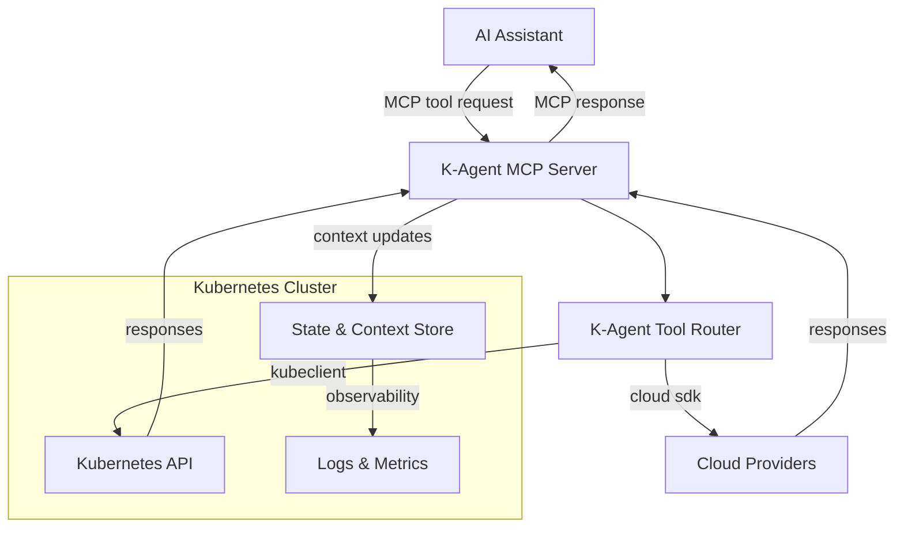
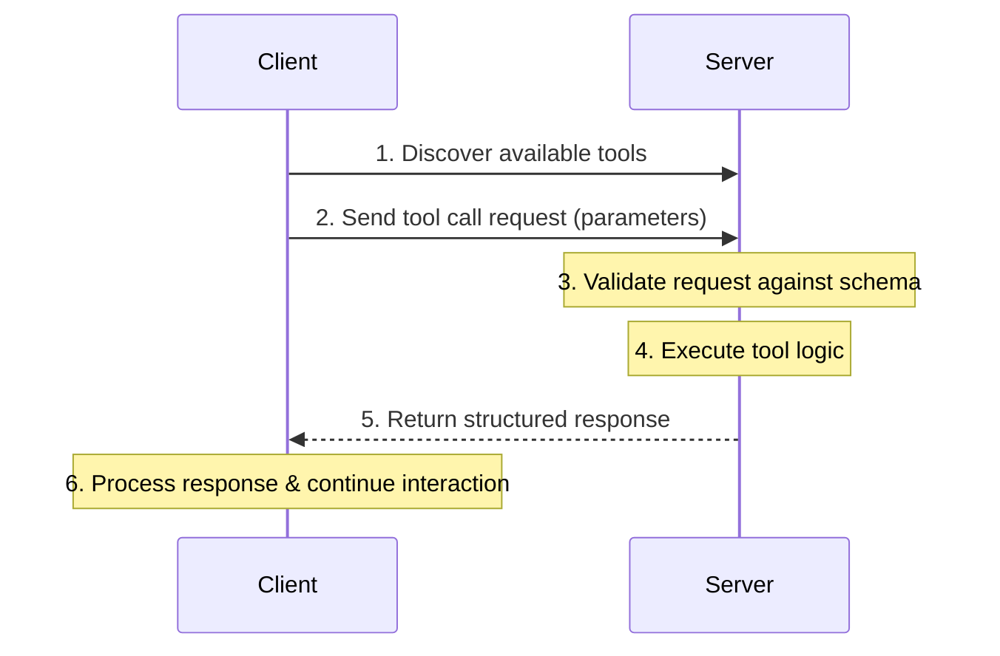

# Lab 001 - MCP Basics

* In this lab, you'll learn about the Model Context Protocol (MCP), the communication standard that enables AI assistants to interact with external tools and services. 
* You'll explore MCP concepts, test simple tools, and understand the protocol structure.
* This lab uses the MCP server included in the K-Agent labs environment.

    !!! danger "Prerequisites"
        * Make sure you have completed [Lab 000 - Environment Setup](../000-setup/) before starting this lab.

#### What you'll learn:

- Understanding Model Context Protocol (MCP) architecture
- MCP server and client communication
- Tool definitions and JSON schemas
- Testing MCP tools with stdio transport

**Estimated time:** 10-12 minutes

---

## 01. What is MCP?

* The **Model Context Protocol (MCP)** is an open protocol that standardizes how AI applications interact with external data sources and tools. 
* It defines a structured way for AI assistants (clients) to discover, call, and receive responses from tools (servers) using JSON-RPC over various transport layers.
* MCP is designed to be flexible and extensible, allowing developers to create custom tools that can be easily integrated with different AI models.
  
### What does MCP offer?

<div class="grid cards" markdown>

-   #### Standardized Communication
    AI assistants can work with any MCP-compatible tool

-   #### Tool Discovery
    Clients can discover available tools from servers

-   #### Structured Interaction 
    Well-defined input/output schemas using JSON

-   #### Standardized Communication
    AI assistants can work with any MCP-compatible tool

-   #### Tool Discovery
    Clients can discover available tools from servers

-   #### Structured Interaction
    Well-defined input/output schemas using JSON

-   #### Multiple Transports
    Supports stdio, HTTP, WebSocket

</div>

---


### K-Agent Architecture Flow



---

## 02. MCP Components


### MCP Server

<div class="cards grid single-column" markdown>

- #### Exposes tools/resources to clients

    * Provides a standardized interface for tool interaction
    * Allows AI assistants to discover and call tools
    * Manages tool lifecycle and execution
    * Handles tool errors and retries

</div>

<div class="cards grid single-column" markdown>

- #### Implements the MCP protocol

    * Follows JSON-RPC 2.0 specification
    * Supports multiple transport layers (stdio, HTTP, WebSocket)
    * Manages tool schemas and validation
    * Supports tool discovery and listing
    * Provides structured responses

</div>
<div class="cards grid single-column" markdown>

- #### Typical MCP Server Features
 
    * Runs as a standalone process or service
    * Can be deployed locally or in the cloud
  	* Can run in containers or serverless environments
    * Scales based on demand
    * Monitors tool usage and performance
    * Logs tool interactions for auditing
    * Supports authentication and authorization
    * Integrates with AI assistants and applications
    * Defines tool schemas (inputs/outputs)
    * Handles tool execution
  
</div>

<div class="cards grid single-column" markdown>

- #### MCP Server Notes

    * Communicates via transport layer (stdio, HTTP, WebSocket)
    * Typically runs as a local process or container
    * In K-Agent, the MCP server exposes Kubernetes and cloud management tools.
    * The server listens for incoming MCP requests from AI assistants and executes the requested tools.
    * In our lab The server translates MCP tool calls into Kubernetes API calls or cloud service operations.
    * The server returns structured responses back to the AI assistant.
    * The server can also update context/state in a datastore for persistent information.
    * The server is implemented using the MCP SDK, which simplifies tool definition and communication handling.
    * The server supports multiple transport layers, allowing it to communicate with different types of AI assistants.
    
</div>

---

### MCP Client

<div class="cards grid single-column" markdown>

- ### General MCP Client Features

    * Discovers available tools from MCP servers
    * Sends tool call requests with parameters
    * Receives and processes tool responses
    * Manages tool invocation lifecycle
    * Handles errors and retries
    * Typically embedded in remote AI assistants (Claude, ChatGPT, etc.) or local models (Ollama, etc.)

</div>

<div class="cards grid single-column" markdown>

- ### The Host Application

    * The `Client` is often part of a **Host Application** (like VS Code, Claude Desktop, or a CLI).
    * The Host manages the connection to the MCP Server.
    * It provides the user interface for interacting with the AI.
    * It handles permissions (asking the user before running a tool).

</div>

### Client Capabilities

| Capability          | Description                                                                 |
|---------------------|-----------------------------------------------------------------------------|
| **Sampling**        | The server can request the client to sample an LLM (generate text).         |
| **Roots**           | The client can tell the server which files/folders are accessible.          |
| **Notifications**   | The client can receive notifications from the server (e.g. logs, progress). |
| **Context Updates** | The client can send context/state updates to the server.                    |
| **Authentication**  | The client can provide authentication tokens/credentials to the server.     |
| **Transport**       | The client supports multiple transport layers (stdio, HTTP, WebSocket).     |
| **Error Handling**  | The client manages errors and retries for tool calls.                       |
| **Tool Discovery**  | The client can list available tools from the server.                        |
| **Tool Invocation** | The client can call tools with parameters and receive structured responses. |
| **Logging**         | The client can log tool interactions for auditing and debugging.            |
	

---

### Transport Layer - MCP Communication

* MCP supports multiple transport mechanisms:

| Protocol    | Description                             |
|-------------|-----------------------------------------|
| `stdio`     | Standard input/output (used in K-Agent) |
| `HTTP`      | RESTful API communication               |
| `WebSocket` | Real-time bidirectional communication   |
| `gRPC`      | High-performance RPC framework          |
| `MQTT`      | Lightweight messaging protocol          |
| `Custom`    | Any custom transport implementation     |

---

### MCP Communication Flow



---

## 03. MCP Tool Structure

* An MCP tool consists of:

<div class="cards grid single-column" markdown>
- #### Tool Definition

    * Metadata about the tool (name, description)
    * Input schema defining parameters
    * Output schema defining response structure
    * Versioning information
    * Dependencies and requirements
    * Authentication requirements
    * Rate limiting information
    * Error handling strategies
</div>

<div class="cards grid single-column" markdown>
- #### Tool Handler
    * Function that implements the tool's logic
    * Receives input parameters
    * Performs the tool's operation
    * Returns structured output
    * Handles errors and exceptions
    * Logs execution details
    * Manages state/context if needed
</div>

<div class="cards grid single-column" markdown>
- #### Tool Execution Flow
    * Client discovers tool from server
    * Client sends tool call request with parameters
    * Server validates request against tool schema
    * Server invokes tool handler with parameters
    * Tool handler executes logic and returns response
    * Server sends structured response back to client
</div>

<div class="cards grid single-column" markdown>
- ### Input Schema
      * Defines expected parameters for the tool
      * Uses JSON Schema format
      * Specifies data types, required fields, and descriptions
      * Enables validation of incoming requests
      * Facilitates client-side form generation
      * Supports complex nested structures
      * Allows default values and constraints
      * Enhances interoperability between clients and servers
</div>

---

#### Examples:

* **Tool Definition**:
  
    ```typescript
    {
      name: "hello",
      description: "Returns a greeting message",
      inputSchema: {
        type: "object",
        properties: {
          name: {
            type: "string",
            description: "Name to greet"
          }
        },
        required: ["name"]
      }
    }
    ```

* **Tool Handler:**

    ```typescript
    async function handleHello(args: { name: string }) {
      return {
        content: [
          {
            type: "text",
            text: `Hello, ${args.name}!`
          }
        ]
      };
    }
    ```

---

## 04. K-Agent MCP Server Overview

* Let's examine the MCP server included in the labs environment.
* We will use all the tools locally, but we also have the option to use Docker.
* The Example MCP server is implemented in TypeScript using the MCP SDK.
* It listens for MCP requests over stdio.

* The server implements two simple tools:

1. **hello**: Greets a user by name
2. **add**: Adds two numbers

---

## 05. Testing MCP Tools (TS)

### Using MCP Inspector

* MCP Inspector is a tool for testing MCP servers interactively.

  ```bash
  # Install mcp-inspector (if not already installed)
  npm install -g @modelcontextprotocol/inspector

  # Start the MCP Inspector with the TS code
  npx @modelcontextprotocol/inspector node ./build/index.js
  ```

!!! info "MCP Inspector UI"
    * MCP Inspector will start a web interface at `http://localhost:6274`
    * You can also test tools programmatically using the examples below.

---

**Step-by-step MCP Inspector Testing:**

1. Get the Authentication Token  
   When you start MCP Inspector, the terminal displays:
   
    ```
    🔑 Session token: [long-token-string]
    
    🔗 Open inspector with token pre-filled:
        http://localhost:6274/?MCP_PROXY_AUTH_TOKEN=[token]
    ```

2. Copy the Authentication URL  
   Copy the complete URL with the token (the second line starting with `http://`)

3. Open MCP Inspector in Your Browser  
   Paste the complete URL from step 2 into your browser. You'll be authenticated immediately.

4. Configure the Server Connection  
   In the MCP Inspector interface:
   
      - Verify the **"Transport"** is set to **`stdio`** (NOT http or streamable-http)
      - You'll see a **"Command"** field - it should already show: `node`
      - look for the **"Argument"** field - it should show: `/app/build/index.js`
      - Click the **"Connect"** button
      - Wait for the status to show **"Connected"** with a green indicator

5. Explore Available Tools:
  
      - Once connected, click on the **"Tools"** tab at the top of the interface, and the on **"List Tools"** button
      - You'll see a list of available tools from your MCP server:
        - `hello`: Returns a friendly greeting message
        - `add`: Adds two numbers together

6. Test the Hello Tool 
 
      - Click the `hello` tool from the list
      - You'll see an input form for the tool's parameters
      - In the **name** field, enter: `K-Agent User`
      - Click **"Run Tool"**
      - **Expected Result** - You should see:
        - **Tool Result: Success**
        - **Message**: `Hello, K-Agent User! Welcome to K-Agent Labs.`

7. Test the Add Tool  

      - In the Tools tab, find and click the `add` tool
      - You'll see input fields for two parameters:
        - **a**: Enter `5`
        - **b**: Enter `3`
      - Click **"Run Tool"**
      - **Expected Result**: You should see:
        - **Tool Result: Success**
        - **Message**: `The sum of 5 and 3 is 8`

!!! warning "Authentication Required"
    * The MCP Inspector requires authentication by default. 
    * Always use the URL with the token (shown in the terminal when you start the inspector), or manually enter the token in the Configuration settings. 
    * If you forget the token, restart the MCP Inspector to generate a new one.

!!! tip "Disabling Authentication (Development Only)"
    Y* ou can disable authentication by setting the `DANGEROUSLY_OMIT_AUTH=true` environment variable:
    ```bash
    DANGEROUSLY_OMIT_AUTH=true npx @modelcontextprotocol/inspector node /app/build/index.js
    ```
    **⚠️ WARNING**: This is dangerous and should ONLY be used in isolated development environments, never in production or when exposed to the internet.

!!! warning "Keep MCP Inspector Running"
    * Make sure the MCP Inspector command (`npx @modelcontextprotocol/inspector node /app/build/index.js`) is still running in your terminal. 
    * If the connection fails or you see errors, restart the command in the container.

!!! tip "Interactive Testing"
    * The MCP Inspector provides a user-friendly web interface to test your MCP server without writing code. 
    * This is perfect for debugging and understanding how MCP tools work before integrating them with AI assistants.
    
!!! explore "Understanding MCP Inspector Output"
    * The Inspector displays tool results in a readable format. 
    * Internally, MCP uses JSON-RPC 2.0 protocol with structured responses, but the UI shows you the human-readable content. 
    * For JSON view, see the "History" section below the UI

---

### Testing Tools via Command Line

Let's test the MCP tools using a simple Node.js script.

!!! info "Running Multiple Sessions"
    You can run this command-line test **while keeping the MCP Inspector running**. The script creates its own MCP server process, so it won't interfere with the Inspector.

**Create test script:**

```bash
# Open a new terminal and connect to the container
docker exec -it kagent-controller bash

# Inside the container, create and run the test script
cat > /labs-scripts/test-index.js << 'EOF'
const { spawn } = require('child_process');

// Start MCP server process
const mcpServer = spawn('node', ['/app/build/index.js']);

let responseData = '';

// Send ListTools request
const listToolsRequest = {
  jsonrpc: "2.0",
  id: 1,
  method: "tools/list",
  params: {}
};

// Send request to server
mcpServer.stdin.write(JSON.stringify(listToolsRequest) + '\n');

// Collect response
mcpServer.stdout.on('data', (data) => {
  responseData += data.toString();
  console.log('Server response:', data.toString());
});

// Wait and send tool call
setTimeout(() => {
  const toolCallRequest = {
    jsonrpc: "2.0",
    id: 2,
    method: "tools/call",
    params: {
      name: "hello",
      arguments: {
        name: "K-Agent User"
      }
    }
  };
  
  mcpServer.stdin.write(JSON.stringify(toolCallRequest) + '\n');
}, 1000);

// Cleanup after 3 seconds
setTimeout(() => {
  mcpServer.kill();
  process.exit(0);
}, 3000);
EOF

# Run the test
node /labs-scripts/test-index.js
```

!!! tip "Expected Output"
    When you run this script, you should see JSON-RPC responses from the MCP server, showing the raw protocol communication that happens behind the scenes in MCP Inspector.

---

## 06. Understanding JSON-RPC Protocol

* MCP uses JSON-RPC 2.0 for communication. 
* Every request/response follows this structure:

### Request Format

```json
{
  "jsonrpc": "2.0",
  "id": 1,
  "method": "tools/call",
  "params": {
    "name": "hello",
    "arguments": {
      "name": "Alice"
    }
  }
}
```

### Response Format

```json
{
  "jsonrpc": "2.0",
  "id": 1,
  "result": {
    "content": [
      {
        "type": "text",
        "text": "Hello, Alice!"
      }
    ]
  }
}
```

---

## 07. Hands-on Exercise

!!! info "Hands-on JSON-RPC Testing"
    * These exercises provide direct interaction with the MCP server using JSON-RPC protocol over stdio. 
    * This gives you a deeper understanding of how MCP communication works at the protocol level.

### Exercise 1: List Available Tools

Test listing tools from the MCP server using direct JSON-RPC communication:

```bash
# Connect to container
docker exec -it kagent-controller bash

# Inside the container, create a test script
cat > /labs-scripts/test-list-tools.js << 'EOF'
const { spawn } = require("child_process");

console.log("Starting MCP server test...");

try {
  // Start MCP server
  const server = spawn("node", ["/app/build/index.js"], {
    stdio: ["pipe", "pipe", "pipe"]
  });

  console.log("Server spawned, PID:", server.pid);

  server.stdout.on("data", (data) => {
    console.log("RESPONSE:", data.toString().trim());
  });

  server.stderr.on("data", (data) => {
    console.log("SERVER:", data.toString().trim());
  });

  // Send tools/list request
  const listRequest = {
    jsonrpc: "2.0",
    id: 1,
    method: "tools/list",
    params: {}
  };

  setTimeout(() => {
    console.log("Sending:", JSON.stringify(listRequest));
    server.stdin.write(JSON.stringify(listRequest) + "\n");
  }, 1000);

  // Exit after 5 seconds
  setTimeout(() => {
    server.kill();
    process.exit(0);
  }, 5000);

} catch (error) {
  console.error("Error:", error.message);
}
EOF

# Run the test
node /labs-scripts/test-list-tools.js
```

**Expected Output:**
```
Starting MCP server test...
Server spawned, PID: 18211
SERVER: K-Agent MCP Server running on stdio
Sending: {"jsonrpc":"2.0","id":1,"method":"tools/list","params":{}}
RESPONSE: {"result":{"tools":[{"name":"hello","description":"Returns a friendly greeting message","inputSchema":{"type":"object","properties":{"name":{"type":"string","description":"Name to greet"}},"required":["name"]}},{"name":"add","description":"Adds two numbers together","inputSchema":{"type":"object","properties":{"a":{"type":"number","description":"First number"},"b":{"type":"number","description":"Second number"}},"required":["a","b"]}}]},"jsonrpc":"2.0","id":1}
```

### Exercise 2: Call the Hello Tool

* Test calling the hello tool using direct JSON-RPC communication:

```bash
# Connect to container
docker exec -it kagent-controller bash

# Inside the container, create a test script
cat > /labs-scripts/test-hello-tool.js << 'EOF'
const { spawn } = require("child_process");

console.log("Testing hello tool...");

try {
  const server = spawn("node", ["/app/build/index.js"], {
    stdio: ["pipe", "pipe", "pipe"]
  });

  console.log("Server spawned, PID:", server.pid);

  server.stdout.on("data", (data) => {
    console.log("RESPONSE:", data.toString().trim());
  });

  server.stderr.on("data", (data) => {
    console.log("SERVER:", data.toString().trim());
  });

  const helloRequest = {
    jsonrpc: "2.0",
    id: 2,
    method: "tools/call",
    params: {
      name: "hello",
      arguments: {
        name: "K-Agent Lab User"
      }
    }
  };

  setTimeout(() => {
    console.log("Sending:", JSON.stringify(helloRequest));
    server.stdin.write(JSON.stringify(helloRequest) + "\n");
  }, 1000);

  setTimeout(() => {
    server.kill();
    process.exit(0);
  }, 5000);

} catch (error) {
  console.error("Error:", error.message);
}
EOF

# Run the test
node /labs-scripts/test-hello-tool.js
```

**Expected Output:**
```
Testing hello tool...
Server spawned, PID: 18237
SERVER: K-Agent MCP Server running on stdio
Sending: {"jsonrpc":"2.0","id":2,"method":"tools/call","params":{"name":"hello","arguments":{"name":"K-Agent Lab User"}}}
RESPONSE: {"result":{"content":[{"type":"text","text":"Hello, K-Agent Lab User! Welcome to K-Agent Labs."}]},"jsonrpc":"2.0","id":2}
```

### Exercise 3: Call the Add Tool

Test calling the add tool using direct JSON-RPC communication:

```bash
# Connect to container
docker exec -it kagent-controller bash

# Inside the container, create a test script
cat > /labs-scripts/test-add-tool.js << 'EOF'
const { spawn } = require("child_process");

console.log("Testing add tool...");

try {
  const server = spawn("node", ["/app/build/index.js"], {
    stdio: ["pipe", "pipe", "pipe"]
  });

  console.log("Server spawned, PID:", server.pid);

  server.stdout.on("data", (data) => {
    console.log("RESPONSE:", data.toString().trim());
  });

  server.stderr.on("data", (data) => {
    console.log("SERVER:", data.toString().trim());
  });

  const addRequest = {
    jsonrpc: "2.0",
    id: 3,
    method: "tools/call",
    params: {
      name: "add",
      arguments: {
        a: 5,
        b: 3
      }
    }
  };

  setTimeout(() => {
    console.log("Sending:", JSON.stringify(addRequest));
    server.stdin.write(JSON.stringify(addRequest) + "\n");
  }, 1000);

  setTimeout(() => {
    server.kill();
    process.exit(0);
  }, 5000);

} catch (error) {
  console.error("Error:", error.message);
}
EOF

# Run the test
node /labs-scripts/test-add-tool.js
```

**Expected Output:**
```
Testing add tool...
Server spawned, PID: 18263
SERVER: K-Agent MCP Server running on stdio
Sending: {"jsonrpc":"2.0","id":3,"method":"tools/call","params":{"name":"add","arguments":{"a":5,"b":3}}}
RESPONSE: {"result":{"content":[{"type":"text","text":"The sum of 5 and 3 is 8"}]},"jsonrpc":"2.0","id":3}
```

---

## 08. Key Takeaways

!!! success "What You Learned"
    - ✓ MCP is a standardized protocol for AI-tool communication
    - ✓ MCP servers expose tools with defined schemas
    - ✓ Tools have names, descriptions, input schemas, and handlers
    - ✓ JSON-RPC 2.0 is the communication format
    - ✓ Transport can be stdio, HTTP, or WebSocket

!!! info "MCP in Practice"
    MCP servers are typically used by AI assistants like Claude, ChatGPT with plugins, or custom AI applications. The stdio transport allows them to run as local processes.

---

## 09. Additional Resources

- [MCP Specification](https://modelcontextprotocol.io/docs)
- [MCP SDK Documentation](https://github.com/modelcontextprotocol/sdk)
- [JSON-RPC 2.0 Specification](https://www.jsonrpc.org/specification)

---

## 10. Next Steps

Now that you understand MCP basics, you'll learn how to build your own MCP server with Python.

**What's next:**

- [Lab 002 - Python MCP Server](../002-python-server/) - Build a custom MCP server
- Creating custom tools with Python
- Implementing tool handlers
