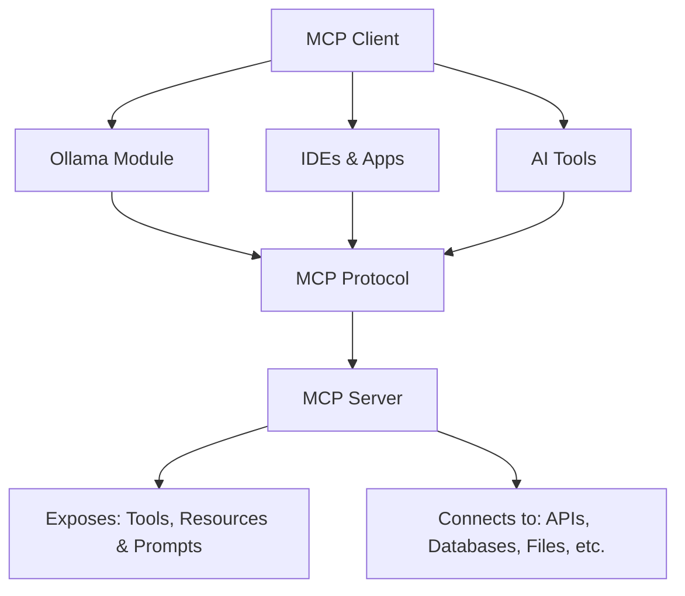
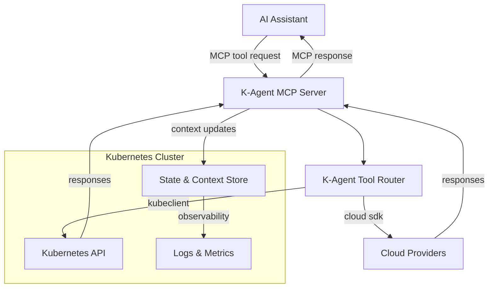
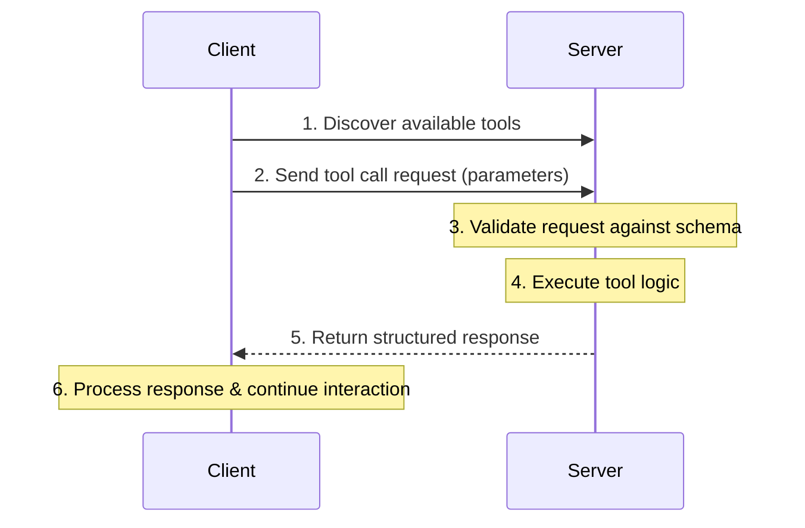

# Lab 1 - MCP Fundamentals

## Overview

* `MCP` is a game-changer for AI application development .
* In this lab, you'll learn about the Model Context Protocol (`MCP`), the communication standard that enables AI assistants to interact with external tools and services. 
* You'll explore MCP concepts, test simple tools, and understand the protocol structure.
* This lab uses the MCP server included in the K-Agent labs environment.

    !!! danger "Prerequisites"
        * Make sure you have completed [Lab 000 - Environment Setup](../000-setup/) before starting this lab.

---

## Learning Objectives

By the end of this lab, you will:

- Understand what `MCP` is and why it was created
- Learn the core architecture and components of `MCP`
- Identify the key capabilities `MCP` provides
- Understand the client-server model in `MCP`
- Recognize common use cases for `MCP`
- Learn MCP server and client communication
- Testing MCP tools with stdio transport

---

## What is MCP?

* The **Model Context Protocol (MCP)** is an open protocol that standardizes how AI applications interact with external data sources and tools. 
* It defines a structured way for AI assistants (clients) to discover, call, and receive responses from tools (servers) using JSON-RPC over various transport layers.
* MCP is designed to be flexible and extensible, allowing developers to create custom tools that can be easily integrated with different AI models.

---

### What does MCP offer?

<div class="grid cards" markdown>

-   #### Standardized Communication
    AI assistants can work with any MCP-compatible tool

-   #### Tool Discovery
    Clients can discover available tools from servers

-   #### Structured Interaction 
    Well-defined input/output schemas using JSON

-   #### Standardized Communication
    AI assistants can work with any MCP-compatible tool

-   #### Tool Discovery
    Clients can discover available tools from servers

-   #### Structured Interaction
    Well-defined input/output schemas using JSON

-   #### Multiple Transports
    Supports stdio, HTTP, WebSocket

</div>

---

### The Problem MCP Solves

Before `MCP`, every AI application had to build custom integrations for each data source or tool it wanted to use. This led to:

- **Fragmentation**: Each app using different methods to connect to the same services
- **Duplication**: Developers rebuilding the same integrations repeatedly
- **Limited scalability**: Adding new integrations was time-consuming and error-prone
- **Inconsistent experiences**: No standard way for LLMs to interact with external systems

---

### The MCP Solution

`MCP` provides a **standardized protocol** that:

- Enables **universal connectivity** between LLMs and data sources
- Allows **one integration to work across all MCP-compatible applications**
- Provides a **consistent interface** for accessing tools, resources, and prompts
- Supports **secure, controlled access** to external systems

---

## MCP Architecture Overview

`MCP` follows a **client-server architecture** with clear separation of concerns:



---

### K-Agent Architecture Flow



---

## MCP Components


### MCP Server

<div class="cards grid single-column" markdown>

- #### Exposes tools/resources to clients

    * Provides a standardized interface for tool interaction
    * Allows AI assistants to discover and call tools
    * Manages tool lifecycle and execution
    * Handles tool errors and retries

</div>

<div class="cards grid single-column" markdown>

- #### Implements the MCP protocol

    * Follows JSON-RPC 2.0 specification
    * Supports multiple transport layers (stdio, HTTP, WebSocket)
    * Manages tool schemas and validation
    * Supports tool discovery and listing
    * Provides structured responses

</div>
<div class="cards grid single-column" markdown>

- #### Typical MCP Server Features
 
    * Runs as a standalone process or service
    * Can be deployed locally or in the cloud
  	* Can run in containers or serverless environments
    * Scales based on demand
    * Monitors tool usage and performance
    * Logs tool interactions for auditing
    * Supports authentication and authorization
    * Integrates with AI assistants and applications
    * Defines tool schemas (inputs/outputs)
    * Handles tool execution
  
</div>

<div class="cards grid single-column" markdown>

- #### MCP Server Notes

    * Communicates via transport layer (stdio, HTTP, WebSocket)
    * Typically runs as a local process or container
    * In K-Agent, the MCP server exposes Kubernetes and cloud management tools.
    * The server listens for incoming MCP requests from AI assistants and executes the requested tools.
    * In our lab The server translates MCP tool calls into Kubernetes API calls or cloud service operations.
    * The server returns structured responses back to the AI assistant.
    * The server can also update context/state in a datastore for persistent information.
    * The server is implemented using the MCP SDK, which simplifies tool definition and communication handling.
    * The server supports multiple transport layers, allowing it to communicate with different types of AI assistants.
    
</div>

---

### MCP Client

<div class="cards grid single-column" markdown>

- ### General MCP Client Features

    * The application that hosts the LLM (e.g., Roo Code, VS Code, Visual Studio, etc.)
    * Discovers available tools from MCP servers
    * Sends tool call requests with parameters
    * Receives and processes tool responses
    * Manages tool invocation lifecycle
    * Handles errors and retries
    * Typically embedded in remote AI assistants (Claude, ChatGPT, etc.) or local models (Ollama, etc.)
    * Presents server capabilities to the user/LLM

</div>

<div class="cards grid single-column" markdown>

- ### The Host Application

    * The `Client` is often part of a **Host Application** (like VS Code, Claude Desktop, or a CLI).
    * The Host manages the connection to the MCP Server.
    * It provides the user interface for interacting with the AI.
    * It handles permissions (asking the user before running a tool).

</div>

### Client Capabilities

| Capability          | Description                                                                 |
|---------------------|-----------------------------------------------------------------------------|
| **Sampling**        | The server can request the client to sample an LLM (generate text).         |
| **Roots**           | The client can tell the server which files/folders are accessible.          |
| **Notifications**   | The client can receive notifications from the server (e.g. logs, progress). |
| **Context Updates** | The client can send context/state updates to the server.                    |
| **Authentication**  | The client can provide authentication tokens/credentials to the server.     |
| **Transport**       | The client supports multiple transport layers (stdio, HTTP, WebSocket).     |
| **Error Handling**  | The client manages errors and retries for tool calls.                       |
| **Tool Discovery**  | The client can list available tools from the server.                        |
| **Tool Invocation** | The client can call tools with parameters and receive structured responses. |
| **Logging**         | The client can log tool interactions for auditing and debugging.            |
	

---

### Transport Layer - MCP Communication

* MCP supports multiple transport mechanisms:

| Protocol    | Description                             |
|-------------|-----------------------------------------|
| `stdio`     | Standard input/output (used in K-Agent) |
| `HTTP`      | RESTful API communication               |
| `WebSocket` | Real-time bidirectional communication   |
| `gRPC`      | High-performance RPC framework          |
| `MQTT`      | Lightweight messaging protocol          |
| `Custom`    | Any custom transport implementation     |

---

### MCP Communication Flow



## MCP Tool Structure

* An MCP tool consists of:

<div class="cards grid single-column" markdown>
- #### Tool Definition

    * Metadata about the tool (name, description)
    * Input schema defining parameters
    * Output schema defining response structure
    * Versioning information
    * Dependencies and requirements
    * Authentication requirements
    * Rate limiting information
    * Error handling strategies
</div>

<div class="cards grid single-column" markdown>
- #### Tool Handler
    * Function that implements the tool's logic
    * Receives input parameters
    * Performs the tool's operation
    * Returns structured output
    * Handles errors and exceptions
    * Logs execution details
    * Manages state/context if needed
</div>

<div class="cards grid single-column" markdown>
- #### Tool Execution Flow
    * Client discovers tool from server
    * Client sends tool call request with parameters
    * Server validates request against tool schema
    * Server invokes tool handler with parameters
    * Tool handler executes logic and returns response
    * Server sends structured response back to client
</div>

<div class="cards grid single-column" markdown>
- ### Input Schema
      * Defines expected parameters for the tool
      * Uses JSON Schema format
      * Specifies data types, required fields, and descriptions
      * Enables validation of incoming requests
      * Facilitates client-side form generation
      * Supports complex nested structures
      * Allows default values and constraints
      * Enhances interoperability between clients and servers
</div>

---

## Core MCP Capabilities

`MCP` servers can expose three main types of capabilities:

### 1. **Tools**
Functions that the LLM can call to perform actions or retrieve information.

**Examples:**

- Search a database
- Make an API call
- Perform calculations
- Execute system commands

**Characteristics:**

- Defined with JSON Schema for input validation
- Return structured results
- Can have side effects (create, update, delete operations)

#### Examples:

* **Tool Definition**:
  
    ```typescript
    {
      name: "hello",
      description: "Returns a greeting message",
      inputSchema: {
        type: "object",
        properties: {
          name: {
            type: "string",
            description: "Name to greet"
          }
        },
        required: ["name"]
      }
    }
    ```

* **Tool Handler:**

    ```typescript
    async function handleHello(args: { name: string }) {
      return {
        content: [
          {
            type: "text",
            text: `Hello, ${args.name}!`
          }
        ]
      };
    }
    ```

---

### 2. **Resources**
Contextual data that can be read by the LLM.

**Examples:**

- File contents
- Database records
- API responses
- Documentation

**Characteristics:**

- Identified by URI (Uniform Resource Identifier)
- Can be text, binary, or structured data
- Typically read-only
- Support for templates and subscriptions

---

### 3. **Prompts**
Pre-built prompt templates that users can invoke.

**Examples:**

- Code review templates
- Documentation generation prompts
- Analysis frameworks
- Interaction patterns

**Characteristics:**

- Can include embedded resources
- Support arguments for customization
- Help standardize common tasks
- Improve consistency and quality


---

## The MCP Lifecycle

Understanding how `MCP` clients and servers interact:

### 1. **Initialization**
- Client connects to server via transport layer
- Handshake to establish protocol version and capabilities
- Server sends initial tool/resource/prompt listings
- Client acknowledges and prepares for interaction
    
### 2. **Capability Discovery**
- Client requests list of available tools, resources, or prompts
- Server responds with detailed descriptions
- Client presents these to the user/LLM
- Client selects tools/resources/prompts to use

### 3. **Execution**
- Client sends requests to invoke tools, read resources, or render prompts
- Server processes the request
- Server returns results in standardized format
- Client handles the response and continues interaction

### 4. **Cleanup**
- Either party can close the connection
- Graceful shutdown with notifications

---

## MCP Communication Model

`MCP` uses **three types of messages**:

### 1. **Requests**
- Require a response
- Include a unique request ID
- Examples: `tools/list`, `resources/read`, `tools/call`

### 2. **Responses**
- Match to requests by ID
- Contain either results or errors
- Must be sent for every request

### 3. **Notifications**
- One-way messages
- Don't require responses
- Examples: `notifications/initialized`, `notifications/cancelled`

---


## Security Considerations

When working with `MCP`, keep these best practices in mind:

1. **Authentication & Authorization**
   
      - Servers should validate requests
      - Use appropriate credentials management
      - Implement least-privilege access

2. **Data Privacy**
   
      - Be mindful of what data is exposed
      - Implement proper access controls
      - Consider encryption for sensitive data

3. **Rate Limiting**
   
      - Protect against abuse
      - Implement appropriate throttling
      - Monitor usage patterns

4. **Input Validation**
   
      - Always validate tool inputs
      - Sanitize user-provided data
      - Prevent injection attacks


---

## Common Use Cases

`MCP` is ideal for:

### Enterprise Integration
- Connect LLMs to internal databases
- Access corporate knowledge bases
- Integrate with business tools (CRM, ERP, etc.)

### Developer Tools
- File system access
- Git operations
- Database queries
- API testing and documentation

### Data Analysis
- Query and visualize data
- Generate reports
- Perform statistical analysis
- Access multiple data sources

### Productivity
- Calendar and email management
- Task and project tracking
- Document processing
- Automated workflows

---

## MCP vs. Other Approaches

| Approach | Pros | Cons |
|----------|------|------|
| **Function Calling** | Simple, direct | Requires custom implementation per app |
| **API Integration** | Flexible | No standard, duplicated effort |
| **MCP** | Universal standard, reusable, scalable | Requires initial setup |

---

## Hands-On Exercise

### Explore an MCP Server Configuration

Look at how an `MCP` server is configured in a client application (like Roo Code):

```json
{
  "mcpServers": {
    "example-server": {
      "command": "node",
      "args": ["/path/to/server/index.js"],
      "env": {
        "API_KEY": "your-api-key"
      }
    }
  }
}
```

---

## Testing MCP Tools (TS)

### Using MCP Inspector

`MCP Inspector` is a tool for testing MCP servers interactively.

  ```bash
  # Install mcp-inspector (if not already installed)
  npm install -g @modelcontextprotocol/inspector

  # Start the MCP Inspector with the TS code
  npx @modelcontextprotocol/inspector node ./build/index.js
  ```

!!! info "MCP Inspector UI"
    * MCP Inspector will start a web interface at `http://localhost:6274`
    * You can also test tools programmatically using the examples below.

---

**Step-by-step MCP Inspector Testing:**

1. Get the Authentication Token  
   When you start MCP Inspector, the terminal displays:
   
    ```
    🔑 Session token: [long-token-string]
    
    🔗 Open inspector with token pre-filled:
        http://localhost:6274/?MCP_PROXY_AUTH_TOKEN=[token]
    ```

2. Copy the Authentication URL  
   Copy the complete URL with the token (the second line starting with `http://`)

3. Open MCP Inspector in Your Browser  
   Paste the complete URL from step 2 into your browser. You'll be authenticated immediately.

4. Configure the Server Connection  
   In the MCP Inspector interface:
   
      - Verify the **"Transport"** is set to **`stdio`** (NOT http or streamable-http)
      - You'll see a **"Command"** field - it should already show: `node`
      - look for the **"Argument"** field - it should show: `/app/build/index.js`
      - Click the **"Connect"** button
      - Wait for the status to show **"Connected"** with a green indicator

5. Explore Available Tools:
  
      - Once connected, click on the **"Tools"** tab at the top of the interface, and the on **"List Tools"** button
      - You'll see a list of available tools from your MCP server

        
!!! warning "Authentication Required"
    * The MCP Inspector requires authentication by default. 
    * Always use the URL with the token (shown in the terminal when you start the inspector), or manually enter the token in the Configuration settings. 
    * If you forget the token, restart the MCP Inspector to generate a new one.

!!! tip "Disabling Authentication (Development Only)"
    Y* ou can disable authentication by setting the `DANGEROUSLY_OMIT_AUTH=true` environment variable:
    ```bash
    DANGEROUSLY_OMIT_AUTH=true npx @modelcontextprotocol/inspector node /app/build/index.js
    ```
    **⚠️ WARNING**: This is dangerous and should ONLY be used in isolated development environments, never in production or when exposed to the internet.

!!! warning "Keep MCP Inspector Running"
    * Make sure the MCP Inspector command (`npx @modelcontextprotocol/inspector node /app/build/index.js`) is still running in your terminal. 
    * If the connection fails or you see errors, restart the command in the container.

!!! tip "Interactive Testing"
    * The MCP Inspector provides a user-friendly web interface to test your MCP server without writing code. 
    * This is perfect for debugging and understanding how MCP tools work before integrating them with AI assistants.
    
!!! explore "Understanding MCP Inspector Output"
    * The Inspector displays tool results in a readable format. 
    * Internally, MCP uses JSON-RPC 2.0 protocol with structured responses, but the UI shows you the human-readable content. 
    * For JSON view, see the "History" section below the UI

---

**Ready to build your first MCP server? [Continue to Lab 2!](../Lab02-First-MCP-Server/index.md)**
