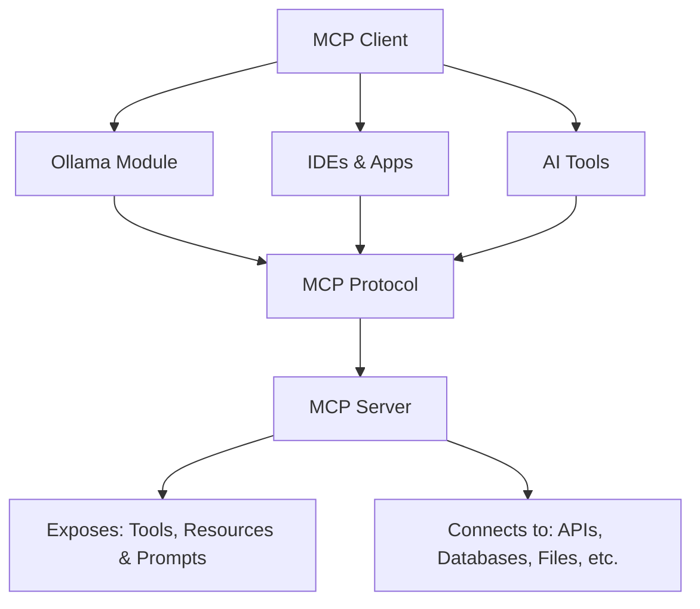
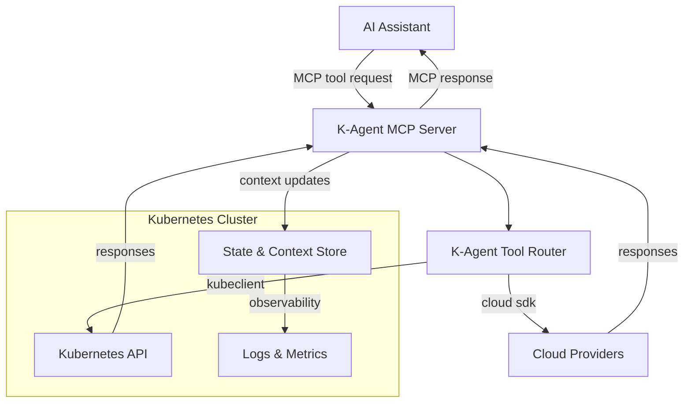
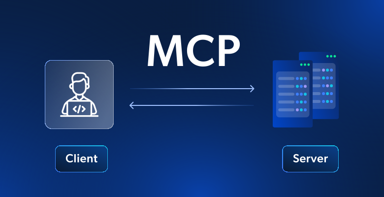
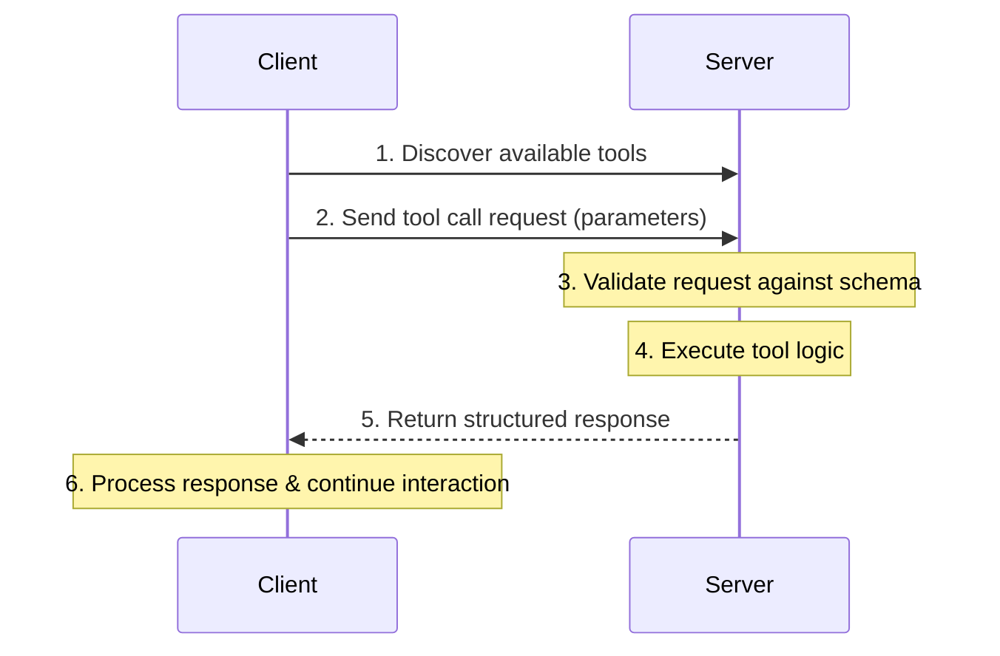

# Lab 1 - MCP Fundamentals

## Overview

* `MCP` is a game-changer for AI application development .
* In this lab, you'll learn about the Model Context Protocol (`MCP`), the communication standard that enables AI assistants to interact with external tools and services. 
* You'll explore MCP concepts, test simple tools, and understand the protocol structure.
* This lab uses the MCP server included in the K-Agent labs environment.

    !!! danger "Prerequisites"
        * Make sure you have completed [Lab 000 - Environment Setup](../000-setup/) before starting this lab.

---

## Learning Objectives

By the end of this lab, you will:

- Understand what `MCP` is and why it was created
- Learn the core architecture and components of `MCP`
- Identify the key capabilities `MCP` provides
- Understand the client-server model in `MCP`
- Recognize common use cases for `MCP`
- Learn MCP server and client communication
- Testing MCP tools with stdio transport

---

## What is MCP?

* The **Model Context Protocol (MCP)** is an open protocol that standardizes how AI applications interact with external data sources and tools. 
* It defines a structured way for AI assistants (clients) to discover, call, and receive responses from tools (servers) using JSON-RPC over various transport layers.
* MCP is designed to be flexible and extensible, allowing developers to create custom tools that can be easily integrated with different AI models.

---

### What does MCP offer?

<div class="grid cards" markdown>

-   #### Standardized Communication
    AI assistants can work with any MCP-compatible tool

-   #### Tool Discovery
    Clients can discover available tools from servers

-   #### Structured Interaction 
    Well-defined input/output schemas using JSON

-   #### Standardized Communication
    AI assistants can work with any MCP-compatible tool

-   #### Tool Discovery
    Clients can discover available tools from servers

-   #### Structured Interaction
    Well-defined input/output schemas using JSON

-   #### Multiple Transports
    Supports stdio, HTTP, WebSocket

</div>

---

### The Problem MCP Solves

Before `MCP`, every AI application had to build custom integrations for each data source or tool it wanted to use. This led to:

- **Fragmentation**: Each app using different methods to connect to the same services
- **Duplication**: Developers rebuilding the same integrations repeatedly
- **Limited scalability**: Adding new integrations was time-consuming and error-prone
- **Inconsistent experiences**: No standard way for LLMs to interact with external systems

---

### The MCP Solution

`MCP` provides a **standardized protocol** that:

- Enables **universal connectivity** between LLMs and data sources
- Allows **one integration to work across all MCP-compatible applications**
- Provides a **consistent interface** for accessing tools, resources, and prompts
- Supports **secure, controlled access** to external systems

---

## MCP Architecture Overview

`MCP` follows a **client-server architecture** with clear separation of concerns:



---

### K-Agent Architecture Flow



---

## MCP Components



### MCP Server

<div class="cards grid single-column" markdown>

- #### Exposes tools/resources to clients

    * Provides a standardized interface for tool interaction
    * Allows AI assistants to discover and call tools
    * Manages tool lifecycle and execution
    * Handles tool errors and retries

</div>

<div class="cards grid single-column" markdown>

- #### Implements the MCP protocol

    * Follows JSON-RPC 2.0 specification
    * Supports multiple transport layers (stdio, HTTP, WebSocket)
    * Manages tool schemas and validation
    * Supports tool discovery and listing
    * Provides structured responses

</div>
<div class="cards grid single-column" markdown>

- #### Typical MCP Server Features
 
    * Runs as a standalone process or service
    * Can be deployed locally or in the cloud
  	* Can run in containers or serverless environments
    * Scales based on demand
    * Monitors tool usage and performance
    * Logs tool interactions for auditing
    * Supports authentication and authorization
    * Integrates with AI assistants and applications
    * Defines tool schemas (inputs/outputs)
    * Handles tool execution
  
</div>

<div class="cards grid single-column" markdown>

- #### MCP Server Notes

    * Communicates via transport layer (stdio, HTTP, WebSocket)
    * Typically runs as a local process or container
    * In K-Agent, the MCP server exposes Kubernetes and cloud management tools.
    * The server listens for incoming MCP requests from AI assistants and executes the requested tools.
    * In our lab The server translates MCP tool calls into Kubernetes API calls or cloud service operations.
    * The server returns structured responses back to the AI assistant.
    * The server can also update context/state in a datastore for persistent information.
    * The server is implemented using the MCP SDK, which simplifies tool definition and communication handling.
    * The server supports multiple transport layers, allowing it to communicate with different types of AI assistants.
    
</div>

---

### MCP Client

<div class="cards grid single-column" markdown>

- ### General MCP Client Features

    * The application that hosts the LLM (e.g., Roo Code, VS Code, Visual Studio, etc.)
    * Discovers available tools from MCP servers
    * Sends tool call requests with parameters
    * Receives and processes tool responses
    * Manages tool invocation lifecycle
    * Handles errors and retries
    * Typically embedded in remote AI assistants (Claude, ChatGPT, etc.) or local models (Ollama, etc.)
    * Presents server capabilities to the user/LLM

</div>

<div class="cards grid single-column" markdown>

- ### The Host Application

    * The `Client` is often part of a **Host Application** (like VS Code, Claude Desktop, or a CLI).
    * The Host manages the connection to the MCP Server.
    * It provides the user interface for interacting with the AI.
    * It handles permissions (asking the user before running a tool).

</div>

### Client Capabilities

| Capability          | Description                                                                 |
|---------------------|-----------------------------------------------------------------------------|
| **Sampling**        | The server can request the client to sample an LLM (generate text).         |
| **Roots**           | The client can tell the server which files/folders are accessible.          |
| **Notifications**   | The client can receive notifications from the server (e.g. logs, progress). |
| **Context Updates** | The client can send context/state updates to the server.                    |
| **Authentication**  | The client can provide authentication tokens/credentials to the server.     |
| **Transport**       | The client supports multiple transport layers (stdio, HTTP, WebSocket).     |
| **Error Handling**  | The client manages errors and retries for tool calls.                       |
| **Tool Discovery**  | The client can list available tools from the server.                        |
| **Tool Invocation** | The client can call tools with parameters and receive structured responses. |
| **Logging**         | The client can log tool interactions for auditing and debugging.            |
	

---

### Transport Layer - MCP Communication

* MCP supports multiple transport mechanisms:

| Protocol    | Description                             |
|-------------|-----------------------------------------|
| `stdio`     | Standard input/output (used in K-Agent) |
| `HTTP`      | RESTful API communication               |
| `WebSocket` | Real-time bidirectional communication   |
| `gRPC`      | High-performance RPC framework          |
| `MQTT`      | Lightweight messaging protocol          |
| `Custom`    | Any custom transport implementation     |

---

### MCP Communication Flow



## MCP Tool Structure

* An MCP tool consists of:

<div class="cards grid single-column" markdown>
- #### Tool Definition

    * Metadata about the tool (name, description)
    * Input schema defining parameters
    * Output schema defining response structure
    * Versioning information
    * Dependencies and requirements
    * Authentication requirements
    * Rate limiting information
    * Error handling strategies
</div>

<div class="cards grid single-column" markdown>
- #### Tool Handler
    * Function that implements the tool's logic
    * Receives input parameters
    * Performs the tool's operation
    * Returns structured output
    * Handles errors and exceptions
    * Logs execution details
    * Manages state/context if needed
</div>

<div class="cards grid single-column" markdown>
- #### Tool Execution Flow
    * Client discovers tool from server
    * Client sends tool call request with parameters
    * Server validates request against tool schema
    * Server invokes tool handler with parameters
    * Tool handler executes logic and returns response
    * Server sends structured response back to client
</div>

<div class="cards grid single-column" markdown>
- ### Input Schema
      * Defines expected parameters for the tool
      * Uses JSON Schema format
      * Specifies data types, required fields, and descriptions
      * Enables validation of incoming requests
      * Facilitates client-side form generation
      * Supports complex nested structures
      * Allows default values and constraints
      * Enhances interoperability between clients and servers
</div>

---

## Core MCP Capabilities

`MCP` servers can expose three main types of capabilities:

### 1. **Tools**
Functions that the LLM can call to perform actions or retrieve information.

**Examples:**

- Search a database
- Make an API call
- Perform calculations
- Execute system commands

**Characteristics:**

- Defined with JSON Schema for input validation
- Return structured results
- Can have side effects (create, update, delete operations)

#### Examples:

* **Tool Definition**:
  
    ```typescript
    {
      name: "hello",
      description: "Returns a greeting message",
      inputSchema: {
        type: "object",
        properties: {
          name: {
            type: "string",
            description: "Name to greet"
          }
        },
        required: ["name"]
      }
    }
    ```

* **Tool Handler:**

    ```typescript
    async function handleHello(args: { name: string }) {
      return {
        content: [
          {
            type: "text",
            text: `Hello, ${args.name}!`
          }
        ]
      };
    }
    ```

---

### 2. **Resources**
Contextual data that can be read by the LLM.

**Examples:**

- File contents
- Database records
- API responses
- Documentation

**Characteristics:**

- Identified by URI (Uniform Resource Identifier)
- Can be text, binary, or structured data
- Typically read-only
- Support for templates and subscriptions

---

### 3. **Prompts**
Pre-built prompt templates that users can invoke.

**Examples:**

- Code review templates
- Documentation generation prompts
- Analysis frameworks
- Interaction patterns

**Characteristics:**

- Can include embedded resources
- Support arguments for customization
- Help standardize common tasks
- Improve consistency and quality


---

## The MCP Lifecycle

Understanding how `MCP` clients and servers interact:

### 1. **Initialization**
- Client connects to server via transport layer
- Handshake to establish protocol version and capabilities
- Server sends initial tool/resource/prompt listings
- Client acknowledges and prepares for interaction
    
### 2. **Capability Discovery**
- Client requests list of available tools, resources, or prompts
- Server responds with detailed descriptions
- Client presents these to the user/LLM
- Client selects tools/resources/prompts to use

### 3. **Execution**
- Client sends requests to invoke tools, read resources, or render prompts
- Server processes the request
- Server returns results in standardized format
- Client handles the response and continues interaction

### 4. **Cleanup**
- Either party can close the connection
- Graceful shutdown with notifications

---

## MCP Communication Model

`MCP` uses **three types of messages**:

### 1. **Requests**
- Require a response
- Include a unique request ID
- Examples: `tools/list`, `resources/read`, `tools/call`

### 2. **Responses**
- Match to requests by ID
- Contain either results or errors
- Must be sent for every request

### 3. **Notifications**
- One-way messages
- Don't require responses
- Examples: `notifications/initialized`, `notifications/cancelled`

---


## Security Considerations

When working with `MCP`, keep these best practices in mind:

1. **Authentication & Authorization**
   
      - Servers should validate requests
      - Use appropriate credentials management
      - Implement least-privilege access

2. **Data Privacy**
   
      - Be mindful of what data is exposed
      - Implement proper access controls
      - Consider encryption for sensitive data

3. **Rate Limiting**
   
      - Protect against abuse
      - Implement appropriate throttling
      - Monitor usage patterns

4. **Input Validation**
   
      - Always validate tool inputs
      - Sanitize user-provided data
      - Prevent injection attacks


---

## Common Use Cases

`MCP` is ideal for:

### Enterprise Integration
- Connect LLMs to internal databases
- Access corporate knowledge bases
- Integrate with business tools (CRM, ERP, etc.)

### Developer Tools
- File system access
- Git operations
- Database queries
- API testing and documentation

### Data Analysis
- Query and visualize data
- Generate reports
- Perform statistical analysis
- Access multiple data sources

### Productivity
- Calendar and email management
- Task and project tracking
- Document processing
- Automated workflows

---

## MCP vs. Other Approaches

| Approach | Pros | Cons |
|----------|------|------|
| **Function Calling** | Simple, direct | Requires custom implementation per app |
| **API Integration** | Flexible | No standard, duplicated effort |
| **MCP** | Universal standard, reusable, scalable | Requires initial setup |

---

## Hands-On Exercise

### Explore an MCP Server Configuration

Look at how an `MCP` server is configured in a client application (like Roo Code):

```json
{
  "mcpServers": {
    "example-server": {
      "command": "node",
      "args": ["/path/to/server/index.js"],
      "env": {
        "API_KEY": "your-api-key"
      }
    }
  }
}
```

---

## Testing MCP Tools (TS)

### Using MCP Inspector

`MCP Inspector` is a tool for testing MCP servers interactively.

  ```bash
  # Install mcp-inspector (if not already installed)
  npm install -g @modelcontextprotocol/inspector

  # Start the MCP Inspector with the TS code
  npx @modelcontextprotocol/inspector node ./build/index.js
  ```

!!! info "MCP Inspector UI"
    * MCP Inspector will start a web interface at `http://localhost:6274`
    * You can also test tools programmatically using the examples below.

---

**Step-by-step MCP Inspector Testing:**

1. Get the Authentication Token  
   When you start MCP Inspector, the terminal displays:
   
    ```
    🔑 Session token: [long-token-string]
    
    🔗 Open inspector with token pre-filled:
        http://localhost:6274/?MCP_PROXY_AUTH_TOKEN=[token]
    ```

2. Copy the Authentication URL  
   Copy the complete URL with the token (the second line starting with `http://`)

3. Open MCP Inspector in Your Browser  
   Paste the complete URL with the token from step 2 into your browser. You'll be authenticated immediately.

4. Configure the Server Connection  
   In the MCP Inspector interface:
   
      - Verify the **"Transport"** is set to **`stdio`** (NOT http or streamable-http)
      - You'll see a **"Command"** field - it should already show: `node`
      - look for the **"Argument"** field - it should show: `/app/build/index.js`
      - Click the **"Connect"** button
      - Wait for the status to show **"Connected"** with a green indicator

5. Explore Available Tools:
  
      - Once connected, click on the **"Tools"** tab at the top of the interface, and the on **"List Tools"** button
      - You'll see a list of available tools from your MCP server

        
!!! warning "Authentication Required"
    * The MCP Inspector requires authentication by default. 
    * Always use the URL with the token (shown in the terminal when you start the inspector), or manually enter the token in the Configuration settings. 
    * If you forget the token, restart the MCP Inspector to generate a new one.

!!! tip "Disabling Authentication (Development Only)"
    Y* ou can disable authentication by setting the `DANGEROUSLY_OMIT_AUTH=true` environment variable:
    ```bash
    DANGEROUSLY_OMIT_AUTH=true npx @modelcontextprotocol/inspector node /app/build/index.js
    ```
    **⚠️ WARNING**: This is dangerous and should ONLY be used in isolated development environments, never in production or when exposed to the internet.

!!! warning "Keep MCP Inspector Running"
    * Make sure the MCP Inspector command (`npx @modelcontextprotocol/inspector node /app/build/index.js`) is still running in your terminal. 
    * If the connection fails or you see errors, restart the command in the container.

!!! tip "Interactive Testing"
    * The MCP Inspector provides a user-friendly web interface to test your MCP server without writing code. 
    * This is perfect for debugging and understanding how MCP tools work before integrating them with AI assistants.
    
!!! explore "Understanding MCP Inspector Output"
    * The Inspector displays tool results in a readable format. 
    * Internally, MCP uses JSON-RPC 2.0 protocol with structured responses, but the UI shows you the human-readable content. 
    * For JSON view, see the "History" section below the UI

---

## Deep Dive: MCP Base Components (Python Focus)

Now let's examine the essential building blocks of MCP and how they're implemented in Python. We'll focus on the Python implementation since it's often clearer and more accessible than TypeScript.

### 1. **MCP Server Framework (FastMCP)**

The foundation of any MCP server is the server framework. In Python, we use `FastMCP`:

```python
from mcp.server.fastmcp import FastMCP

# Create the MCP server instance
mcp = FastMCP("my-mcp-server", port=8889)
```

**What it does:**

- Provides the HTTP server infrastructure
- Handles JSON-RPC communication
- Manages tool, resource, and prompt registration
- Implements the MCP protocol handshake

**What's inside:**

- HTTP request handlers for all MCP endpoints
- Tool execution engine
- Resource serving system
- Prompt template management

### 2. **Tool Registration Decorator**

Tools are the core functionality exposed by MCP servers:

```python
@mcp.tool()
def hello(name: str) -> str:
    """Returns a friendly greeting message"""
    return f"Hello, {name}! Welcome to K-Agent Labs."
```

**What it produces:**

- A callable function registered with the MCP server
- JSON Schema for input validation
- Metadata for client discovery

**What's inside:**

- Function signature inspection
- Automatic parameter validation
- Execution tracking and logging

### 3. **Resource Handlers**

Resources provide read-only data access:

```python
@mcp.resource("mcp://server-info")
def get_server_info() -> str:
    """Returns information about this MCP server"""
    return """K-Agent MCP Server
    
Version: 0.1.0
Capabilities:
- Tools: hello, add
- Prompts: code_review_prompt, debug_prompt
- Resources: code, server-info
"""
```

**What it produces:**

- A resource accessible via a URI
- Content generation logic
- MIME type specification
- URI-addressable data endpoints
- Structured metadata for discovery
- MIME type information

### 4. **Prompt Templates**

Reusable prompt templates for consistent interactions:

```python
@mcp.prompt()
def code_review_prompt(code: str, language: str = "python") -> str:
    """Generate a code review prompt for the given code"""
    # Create the prompt template with proper markdown formatting
    template = f"""Please review this {language} code and provide feedback:

``` + language + f"""
""" + code + f"""

Focus on:
- Code quality and best practices
- Potential bugs or issues
- Performance improvements
- Security concerns
"""
    return template
```

**What it produces:**

- A prompt template registered with the MCP server
- Argument definitions for dynamic rendering
- Metadata for client discovery
- Parameterized prompt templates
- Standardized interaction patterns
- Consistent output formatting

**Example output when called:**
```
Please review this python code and provide feedback:

&#96;&#96;&#96;python
def hello(): pass
&#96;&#96;&#96;

Focus on:
- Code quality and best practices
- Potential bugs or issues
- Performance improvements
- Security concerns
```


### 5. **Transport Layer (HTTP Routes)**

Custom routes handle the MCP protocol communication:

```python
@mcp.custom_route("/.well-known/mcp", methods=["GET", "OPTIONS"])
async def mcp_manifest(request: Request) -> JSONResponse:
    manifest = {
        "name": "kagent-mcp-server",
        "version": "0.1.0",
        "capabilities": {
            "tools": True,
            "prompts": True,
            "resources": True,
            "sampling": True
        }
    }
    return JSONResponse(manifest)
```

**What it does:**

- Implements MCP protocol endpoints
- Handles client-server negotiation
- Provides capability discovery

---

## MCP Method Flow with Echo Commands

Let's trace through the Python methods called during a typical MCP interaction, with echo commands to show what's happening:

```python
# 1. Server Initialization
def main():
    print("🔧 Initializing MCP server...")
    mcp = FastMCP("kagent-mcp-server", port=8889)
    print("✅ Server instance created with port 8889")
    
    # Register tools
    print("🛠️  Registering tools...")
    @mcp.tool()
    def hello(name: str) -> str:
        print(f"👋 Executing hello tool for {name}")
        return f"Hello, {name}!"
    print("✅ Tool 'hello' registered")
    
    # Start the server
    print("🚀 Starting MCP server...")
    mcp.run(transport="streamable-http", mount_path="/mcp")
    print("✅ Server running on http://localhost:8889")

# 2. Client Connection Process
async def connect_to_server():
    print("🔗 Connecting to MCP server...")
    
    # Get manifest
    print("📋 Fetching server manifest...")
    manifest = await client.get(f"{base_url}/.well-known/mcp")
    print(f"✅ Got manifest: {manifest['name']} v{manifest['version']}")
    
    # Negotiate connection
    print("🤝 Negotiating connection...")
    negotiate_response = await client.get(f"{base_url}/negotiate")
    print(f"✅ Negotiation complete: {negotiate_response['transport']}")
    
    # List tools
    print("📋 Listing available tools...")
    tools = await client.post(f"{base_url}/tools")
    print(f"✅ Found {len(tools['tools'])} tools")
    
    return True

# 3. Tool Execution Flow
async def execute_tool_flow():
    print("🎯 Executing tool 'hello'...")
    
    # Validate arguments
    print("🔍 Validating tool arguments...")
    # (validation logic here)
    print("✅ Arguments valid")
    
    # Execute tool
    print("⚡ Calling tool function...")
    result = await execute_tool("hello", {"name": "Alice"})
    print(f"✅ Tool executed successfully: {result['result']}")
    
    # Track execution
    print("📊 Recording execution metrics...")
    # (tracking logic here)
    print("✅ Execution tracked")
    
    return result

# 4. Resource Access Flow
async def access_resource_flow():
    print("📖 Accessing resource...")
    
    # Resolve resource URI
    print("🔗 Resolving resource URI...")
    # (URI resolution logic)
    print("✅ Resource resolved")
    
    # Fetch resource content
    print("📥 Fetching resource content...")
    content = await get_resource_content("mcp://server-info")
    print(f"✅ Resource content retrieved ({len(content)} chars)")
    
    return content

# 5. Prompt Usage Flow
async def use_prompt_flow():
    print("📝 Using prompt template...")
    
    # Get prompt template
    print("🔍 Finding prompt template...")
    template = await get_prompt_template("code_review_prompt", 
                                       code="def test(): pass")
    print(f"✅ Template retrieved ({len(template)} chars)")
    
    # Render with arguments
    print("🎨 Rendering prompt with arguments...")
    final_prompt = template  # Already rendered
    print("✅ Prompt rendered")
    
    # Send to LLM
    print("🤖 Sending to LLM for processing...")
    response = await sample_llm(final_prompt)
    print(f"✅ LLM response received ({len(response)} chars)")
    
    return response
```

**Method Call Order:**

1. `FastMCP.__init__()` - Server initialization
2. `@mcp.tool()` decorator - Tool registration
3. `mcp.run()` - Start HTTP server
4. `/.well-known/mcp` GET - Client discovery
5. `/negotiate` GET - Connection negotiation
6. `/tools` POST - Tool discovery
7. `/tools/execute` POST - Tool execution
8. `/resources` GET - Resource discovery
9. `/sampling` POST - LLM interaction

---

## What Realizes MCP

### What Makes MCP Work

MCP is realized through several key mechanisms:

#### 1. **Protocol Standardization**
- **JSON-RPC 2.0** as the communication protocol
- **HTTP transport** for reliable message delivery
- **Capability negotiation** during connection establishment
- **Structured error handling** and response formatting

#### 2. **Component Integration**
- **Server frameworks** (FastMCP, MCP SDK) that implement the protocol
- **Client libraries** that know how to communicate with servers
- **Tool execution engines** that safely run server-provided functions
- **Resource resolution systems** that handle URI-based data access

#### 3. **Security Boundaries**
- **Process isolation** between client and server
- **Input validation** using JSON Schema
- **Access control** through authentication tokens
- **Rate limiting** and abuse prevention

### What's Still Missing

While MCP provides a solid foundation, some aspects are still evolving:

#### 1. **Advanced Authentication**
- OAuth 2.0 integration patterns
- Role-based access control (RBAC)
- Token refresh mechanisms

#### 2. **Streaming and Real-time Updates**
- Server-sent events for live data
- WebSocket support for bidirectional streaming
- Real-time resource subscriptions

#### 3. **Performance Optimization**
- Connection pooling
- Caching strategies
- Batch operation optimizations

#### 4. **Enterprise Features**
- Audit logging and compliance
- Multi-tenant isolation
- Service mesh integration

### Extra Value MCP Provides

Beyond basic integration, MCP adds significant value:

#### 1. **Developer Experience**
- **Consistent APIs** across different tools and services
- **Auto-discovery** of capabilities
- **Type safety** through schema validation
- **Rich tooling** (debuggers, inspectors, documentation)

#### 2. **Operational Benefits**
- **Centralized management** of AI integrations
- **Version compatibility** checking
- **Health monitoring** and metrics
- **Graceful degradation** when services are unavailable

#### 3. **Security Advantages**
- **Controlled access** to external systems
- **Audit trails** of AI actions
- **Input sanitization** and validation
- **Isolation** between different integrations

#### 4. **Scalability Features**
- **Horizontal scaling** of MCP servers
- **Load balancing** across multiple instances
- **Caching layers** for performance
- **Circuit breakers** for resilience

---

## Core Primitive Operations

Let's examine the fundamental MCP operations that make everything work:

### 1. **wellknown/mcp** - Server Discovery

**Location:** `/.well-known/mcp` endpoint  
**When it happens:** During initial client connection  
**How it works:**
```python
@mcp.custom_route("/.well-known/mcp", methods=["GET"])
async def mcp_manifest(request: Request) -> JSONResponse:
    manifest = {
        "name": "kagent-mcp-server",
        "version": "0.1.0",
        "capabilities": {
            "tools": True,
            "prompts": True,
            "resources": True,
            "sampling": True
        },
        "endpoints": {
            "negotiate": "/negotiate",
            "tools": "/tools",
            "resources": "/resources",
            "sampling": "/sampling"
        }
    }
    return JSONResponse(manifest)
```

**Outcome:** Client learns server capabilities and available endpoints

### 2. **negotiate** - Connection Establishment

**Location:** `/negotiate` endpoint  
**When it happens:** After manifest discovery, before using server  
**How it works:**
```python
@mcp.custom_route("/negotiate", methods=["GET", "POST"])
async def negotiate(request: Request) -> JSONResponse:
    token = request.headers.get("x-proxy-token")
    response = {
        "transport": "streamable-http",
        "url": f"{request.url.scheme}://{request.host}/mcp"
    }
    if token:
        response["proxy_token"] = token
    return JSONResponse(response)
```

**Outcome:** Establishes authenticated connection parameters

### 3. **tool/call** - Tool Execution

**Location:** `/tools/execute` endpoint  
**When it happens:** When client wants to execute a tool function  
**How it works:**
```python
@mcp.custom_route("/tools/execute", methods=["POST"])
async def tool_execute(request: Request) -> JSONResponse:
    body = await request.json()
    tool_name = body.get("tool")
    arguments = body.get("arguments", {})
    
    # Validate and execute
    result = await execute_tool(tool_name, arguments)
    return JSONResponse(result)
```

**Outcome:** Executes server-side function and returns structured result

### 4. **resource/read** - Resource Access

**Location:** `/resources` endpoint (for listing) or direct URI resolution  
**When it happens:** When client needs to access data resources  
**How it works:**
```python
@mcp.resource("mcp://server-info")
def get_server_info() -> str:
    return "Server information content"

# Or via endpoint:
@mcp.custom_route("/resources", methods=["GET"])
async def resources_list(request: Request) -> JSONResponse:
    resources = [
        {
            "uri": "mcp://server-info",
            "name": "Server Information",
            "mimeType": "text/plain"
        }
    ]
    return JSONResponse({"resources": resources})
```

**Outcome:** Provides access to structured data through URI-based addressing

### 5. **sampling** - LLM Integration

**Location:** `/sampling` endpoint  
**When it happens:** When client needs LLM processing  
**How it works:**
```python
@mcp.custom_route("/sampling", methods=["POST"])
async def sampling(request: Request) -> JSONResponse:
    body = await request.json()
    prompt = body.get("prompt")
    
    # Call LLM API
    response = await call_llm_api(prompt)
    return JSONResponse({
        "completion": response,
        "model": "llama3.2:latest"
    })
```

**Outcome:** Enables AI processing through standardized interface

---

## Building Your Own MCP Components

### Step-by-Step: Creating a Basic Tool

```python
from mcp.server.fastmcp import FastMCP

mcp = FastMCP("my-basic-server")

@mcp.tool()
def calculate_area(length: float, width: float) -> str:
    """Calculate the area of a rectangle"""
    area = length * width
    return f"The area of a rectangle with length {length} and width {width} is {area}"

@mcp.resource("mcp://math-constants")
def get_math_constants() -> str:
    """Returns common mathematical constants"""
    return """
Pi: 3.14159
E: 2.71828
Golden Ratio: 1.61803
"""

if __name__ == "__main__":
    mcp.run()
```

**What this produces:**
- A tool that can be called by MCP clients
- A resource that can be read by clients
- A complete MCP server ready to run

**What's inside each component:**
- **Tool:** Function + JSON schema + metadata
- **Resource:** URI + content generator + MIME type
- **Server:** HTTP handlers + protocol implementation + capability management

---

## Key Takeaways

✅ MCP consists of **server frameworks**, **tool decorators**, **resource handlers**, and **transport layers**

✅ Python methods follow a **clear execution flow**: init → register → run → handle requests

✅ MCP is realized through **protocol standardization**, **component integration**, and **security boundaries**

✅ Core primitives handle **discovery** (`wellknown/mcp`), **connection** (`negotiate`), **execution** (`tool/call`), and **data access** (`resource/read`)

✅ Each step produces **structured outputs** with **clear interfaces** and **validation**

✅ **Extra value** comes from **consistency**, **security**, **scalability**, and **developer experience**

## Next Steps

In **Lab 2**, you'll get hands-on experience by building your first MCP server from scratch. You'll learn:

- Setting up the development environment
- Creating a basic MCP server structure
- Implementing the initialization handshake
- Testing your server with an MCP client

## Additional Resources

- [MCP Official Documentation](https://modelcontextprotocol.io)
- [MCP Specification](https://spec.modelcontextprotocol.io)
- [MCP GitHub Repository](https://github.com/modelcontextprotocol)
- [JSON-RPC 2.0 Specification](https://www.jsonrpc.org/specification)
- [FastMCP Python Library](https://github.com/jlowin/fastmcp)

---

**Ready to build your first MCP server? [Continue to Lab 2!](../Lab02-First-MCP-Server/index.md)**
