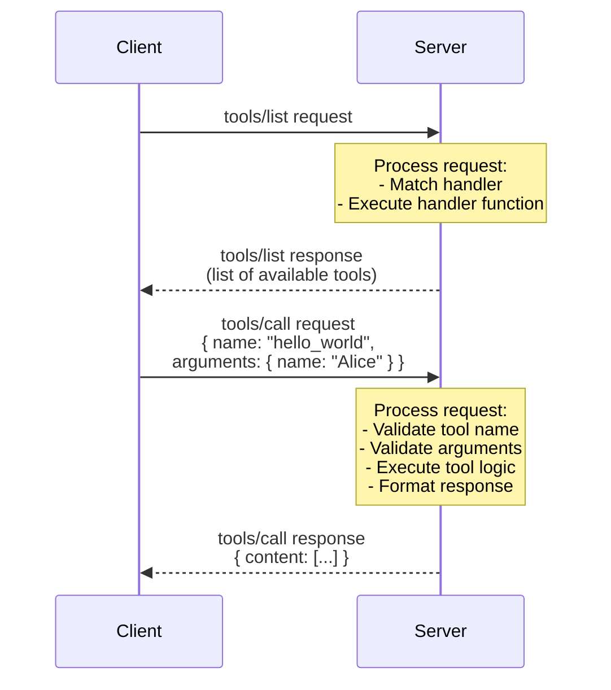

# Lab 2: Building Your First MCP Server

## Overview

* Now that you understand the fundamentals of `MCP`, it's time to get hands-on! 
* In this lab, you'll build a complete, working `MCP` server from scratch. 
* You'll learn how to set up the project, implement the core protocol, and connect it to an `MCP` client.

---


## Learning Objectives

By the end of this lab, you will:

- Set up a `Node.js / TypeScript / Python` project for `MCP` development
- Implement the `MCP` initialization handshake
- Create a basic server structure using the `MCP` SDK
- Test your server with a real `MCP` client
- Understand the request/response lifecycle
- Debug and troubleshoot common issues

---

## Prerequisites

Before starting, ensure you have:

- **Node.js** (v18 or later) installed
- **Python** (v3.8 or later) installed
- **npm** or **yarn** package manager
- A code editor (**VS Code** recommended)
- Basic understanding of **JavaScript** / **TypeScript** / **Python**
- Familiarity with **JSON** and **HTTP**
- Basic knowledge of **MCP concepts** from [Lab 1](../Lab01-MCP-Fundamentals/)

To verify your prerequisites are installed correctly, run the following commands:

```bash
# Check Node.js version
node --version

# Check npm version
npm --version

# Check Python version
python3 --version
python --version

```

---


## Project Setup

### Step 1: Initialize Your Project

- Create a new directory for your `MCP` server, navigate into it, and initialize a new `Node.js` / `Python` project:

    ```bash
    mkdir my-first-mcp-server
    cd my-first-mcp-server
    ```

### Step 2: Install Dependencies

=== "Node.js / TypeScript"

    - Install the MCP SDK and TypeScript dependencies using npm and build tool:
      ```bash
      # Core MCP SDK
      npm install @modelcontextprotocol/sdk

      # TypeScript and type definitions
      npm install -D typescript @types/node

      # Build tool
      npm install -D tsx
      ```

    - To verify TypeScript installation:
      ```bash
      tsc --version
      ```

=== "Python"

    - For this lab, we'll use **FastMCP** which simplifies MCP server development with a Flask-like decorator syntax.
    
    - Create a `requirements.txt` file:
      ```txt
      mcp
      fastmcp
      uvicorn
      httpx
      starlette
      ```

    - Install **uv** (fast Python package installer) if not already installed:
      ```bash
      curl -LsSf https://astral.sh/uv/install.sh | sh
      ```

    - Create and activate a virtual environment, then install dependencies:
      ```bash
      # Create virtual environment using uv
      uv venv

      # Activate virtual environment
      source .venv/bin/activate  # On Windows use `.venv\Scripts\activate`

      # Install dependencies
      uv pip install -r requirements.txt
      ```
      
    - To verify installation:
      ```bash
      python -c "import mcp; print('MCP installed successfully')"
      python -c "from mcp.server.fastmcp import FastMCP; print('FastMCP ready')"
      ```

---

### Step 3: Configure Your Project

=== "Node.js / TypeScript"

    - Create a `tsconfig.json` file:
        ```json
        {
          "compilerOptions": {
            "target": "ES2022",
            "module": "Node16",
            "moduleResolution": "Node16",
            "outDir": "./dist",
            "rootDir": "./src",
            "strict": true,
            "esModuleInterop": true,
            "skipLibCheck": true,
            "forceConsistentCasingInFileNames": true,
            "resolveJsonModule": true,
            "declaration": true
          },
          "include": ["src/**/*"],
          "exclude": ["node_modules", "dist"]
        }
        ```
    - Replace (copy / paste) the entire content of the file `package.json`, located inside the previously created `my-first-mcp-server` directory with this:
        ```json
        {
          "name": "my-first-mcp-server",
          "version": "1.0.0",
          "type": "module",
          "description": "My first MCP server",
          "main": "dist/index.js",
          "scripts": {
            "build": "tsc",
            "dev": "tsx src/index.ts",
            "start": "node dist/index.js"
          },
          "keywords": ["mcp", "server"],
          "author": "Your Name"
        }
        ```
=== "Python"

    - Create a `requirements.txt` file with the necessary dependencies (if not created in Step 2):
      ```txt
      mcp
      fastmcp
      uvicorn
      httpx
      starlette
      ```

---

### Step 4: Create the MCP Server

=== "Node.js / TypeScript"

    - Create a directory named `src` inside `my-first-mcp-server`.
    - Create a file named `index.ts` inside the `src` directory and fill it with the following basic server skeleton code (copy / paste inside the file):

        ```typescript
        #!/usr/bin/env node

        import { Server } from "@modelcontextprotocol/sdk/server/index.js";
        import { StdioServerTransport } from "@modelcontextprotocol/sdk/server/stdio.js";
        import {
          CallToolRequestSchema,
          ListToolsRequestSchema,
        } from "@modelcontextprotocol/sdk/types.js";

        /**
        * Create an MCP server with core capabilities
        */
        class MyFirstMCPServer {
          private server: Server;

          constructor() {
            this.server = new Server(
              {
                name: "my-first-mcp-server",
                version: "1.0.0",
              },
              {
                capabilities: {
                  tools: {},
                },
              }
            );

            this.setupHandlers();
            this.setupErrorHandling();
          }

          /**
          * Set up request handlers
          */
          private setupHandlers(): void {
            // Handler for listing available tools
            this.server.setRequestHandler(
              ListToolsRequestSchema,
              async () => ({
                tools: [
                  {
                    name: "hello_world",
                    description: "Returns a friendly greeting message",
                    inputSchema: {
                      type: "object",
                      properties: {
                        name: {
                          type: "string",
                          description: "The name to greet",
                        },
                      },
                      required: ["name"],
                    },
                  },
                ],
              })
            );

            // Handler for calling tools
            this.server.setRequestHandler(
              CallToolRequestSchema,
              async (request) => {
                const { name, arguments: args } = request.params;

                if (name === "hello_world") {
                  const userName = args?.name as string;
                  
                  if (!userName) {
                    throw new Error("Name parameter is required");
                  }

                  return {
                    content: [
                      {
                        type: "text",
                        text: `Hello, ${userName}! Welcome to your first MCP server! 🎉`,
                      },
                    ],
                  };
                }

                throw new Error(`Unknown tool: ${name}`);
              }
            );
          }

          /**
          * Set up error handling
          */
          private setupErrorHandling(): void {
            this.server.onerror = (error) => {
              console.error("[MCP Error]", error);
            };

            process.on("SIGINT", async () => {
              await this.server.close();
              process.exit(0);
            });
          }

          /**
          * Start the server
          */
          async start(): Promise<void> {
            const transport = new StdioServerTransport();
            await this.server.connect(transport);
            
            console.error("My First MCP Server running on stdio");
          }
        }

        /**
        * Main entry point
        */
        async function main() {
          const server = new MyFirstMCPServer();
          await server.start();
        }

        main().catch((error) => {
          console.error("Fatal error:", error);
          process.exit(1);
        });
        ```

=== "Python"

    - Create a file named `mcp.py` in the root of `my-first-mcp-server` directory and add the following code:

        ```python
        #!/usr/bin/env python3
        from mcp.server.fastmcp import FastMCP
        from starlette.responses import JSONResponse
        from starlette.requests import Request

        # Create FastMCP server instance
        # This will listen on port 8889
        mcp = FastMCP("my-first-mcp-server", port=8889)

        # CORS headers for browser-based inspector
        HEADERS = {
            "Access-Control-Allow-Origin": "*",
            "Access-Control-Allow-Methods": "GET,POST,OPTIONS",
            "Access-Control-Allow-Headers": "Content-Type,Authorization,X-Proxy-Token",
        }

        # Define a simple hello tool using @mcp.tool() decorator
        @mcp.tool()
        def hello_world(name: str) -> str:
            """Returns a friendly greeting message"""
            return f"Hello, {name}! Welcome to your first MCP server! 🎉"

        # Health check endpoint
        @mcp.custom_route("/health", methods=["GET", "OPTIONS"])
        async def health_check(request: Request) -> JSONResponse:
            return JSONResponse({"status": "healthy"}, headers=HEADERS)

        # MCP Manifest endpoint
        @mcp.custom_route("/.well-known/mcp", methods=["GET", "OPTIONS"])
        async def mcp_manifest(request: Request) -> JSONResponse:
            host = request.headers.get("host", "localhost:8889")
            scheme = request.url.scheme or "http"
            base = f"{scheme}://{host}"
            
            manifest = {
                "name": "my-first-mcp-server",
                "version": "1.0.0",
                "base_url": base,
                "transport": "streamable-http",
                "capabilities": {
                    "tools": True,
                    "prompts": False,
                    "resources": False,
                },
                "endpoints": {
                    "manifest": "/.well-known/mcp",
                    "health": "/health",
                    "events": "/mcp",
                },
            }
            return JSONResponse(manifest, headers=HEADERS)

        # Server metadata endpoint
        @mcp.custom_route("/metadata", methods=["GET", "OPTIONS"])
        async def metadata(request: Request) -> JSONResponse:
            return JSONResponse({
                "serverInfo": {
                    "name": "my-first-mcp-server",
                    "version": "1.0.0",
                    "protocolVersion": "2024-11-05"
                },
                "capabilities": {
                    "tools": {"listChanged": False},
                }
            }, headers=HEADERS)

        # Main entry point
        def main():
            # Start the MCP server with streamable-http transport
            # Mounted at /mcp path
            mcp.run(transport="streamable-http", mount_path="/mcp")

        if __name__ == "__main__":
            main()
        ```
---

## Understanding the Code

Let's break down the key components:

=== "Node.js / TypeScript"

    ### 1. **Server Initialization**

    ```typescript
    this.server = new Server(
      {
        name: "my-first-mcp-server",
        version: "1.0.0",
      },
      {
        capabilities: {
          tools: {},
        },
      }
    );
    ```

    - Defines server metadata (name and version)
    - Declares capabilities (in this case, the server supports tools)
    - This information is sent during the initialization handshake

    ### 2. **List Tools Handler**

    ```typescript
    this.server.setRequestHandler(
      ListToolsRequestSchema,
      async () => ({
        tools: [...],
      })
    );
    ```

    - Responds to `tools/list` requests from clients
    - Returns an array of tool definitions
    - Each tool has: name, description and inputSchema (JSON Schema)

    ### 3. **Call Tool Handler**

    ```typescript
    this.server.setRequestHandler(
      CallToolRequestSchema,
      async (request) => {
        // Tool execution logic
      }
    );
    ```

    - Responds to `tools/call` requests
    - Receives tool name and arguments
    - Returns tool results in a standardized format

    ### 4. **Transport Layer**

    ```typescript
    const transport = new StdioServerTransport();
    await this.server.connect(transport);
    ```

    - Uses stdio (standard input/output) for communication
    - Server runs as a subprocess of the client
    - All `MCP` messages flow through stdin/stdout

=== "Python"

    ### 1. **Server Initialization with FastMCP**

    ```python
    mcp = FastMCP("my-first-mcp-server", port=8889)
    ```

    - Creates a FastMCP server instance with a name and port
    - FastMCP uses a Flask-like decorator syntax for simplicity
    - The server will listen on port 8889 for HTTP connections

    ### 2. **Tool Definition with Decorators**

    ```python
    @mcp.tool()
    def hello_world(name: str) -> str:
        """Returns a friendly greeting message"""
        return f"Hello, {name}! Welcome to your first MCP server! 🎉"
    ```

    - The `@mcp.tool()` decorator automatically registers the function as an MCP tool
    - Function signature defines the input parameters (with type hints)
    - Docstring becomes the tool description
    - Return value is automatically formatted as MCP response

    ### 3. **Custom Routes for MCP Protocol**

    ```python
    @mcp.custom_route("/health", methods=["GET", "OPTIONS"])
    async def health_check(request: Request) -> JSONResponse:
        return JSONResponse({"status": "healthy"}, headers=HEADERS)
    ```

    - Custom routes handle MCP protocol endpoints
    - Support for CORS headers enables browser-based inspector access
    - Returns JSON responses following MCP specification

    ### 4. **Transport Layer**

    ```python
    mcp.run(transport="streamable-http", mount_path="/mcp")
    ```

    - Uses streamable-http transport for bi-directional communication
    - Mounts the MCP protocol handler at `/mcp` path
    - Server runs with uvicorn ASGI server automatically

    ### 5. **Tool Execution Helper - Why `get_tool_function`?**

    In more advanced MCP servers (like the full example in `mcp.py`), you'll see a helper function called `get_tool_function`:

    ```python
    def get_tool_function(tool_name: str):
        """Get the actual function for a tool by name"""
        tool_map = {
            'hello_world': hello_world,
            'calculate': calculate,
            'echo': echo,
        }
        return tool_map.get(tool_name)
    ```

    **Why do we need this?**

    1. **Dynamic Tool Execution**: When the MCP Inspector or client sends a tool call request with just the tool name as a string (e.g., `"hello_world"`), we need to map that string to the actual Python function.

    2. **Decoupling Tool Registration from Execution**: While `@mcp.tool()` decorator handles registration, for custom execution workflows (like tracking execution history, adding middleware, or batch execution), we need direct access to the tool functions.

    3. **Tool Validation**: Before executing a tool, we can verify it exists in our tool map, providing better error messages if a non-existent tool is called.

    4. **Execution Tracking**: In the full `mcp.py` example, we use this helper to:
       - Track tool execution history
       - Measure execution time
       - Log tool calls
       - Handle errors consistently

    **Example usage in execution flow:**

    ```python
    async def execute_tool(tool_name: str, arguments: Dict[str, Any]) -> Dict[str, Any]:
        """Execute a tool and return the result"""
        # Get the actual function by name
        tool_func = get_tool_function(tool_name)
        
        if not tool_func:
            return {"error": f"Tool '{tool_name}' not found"}
        
        # Validate arguments against function signature
        valid, message = validate_tool_arguments(tool_func, arguments)
        if not valid:
            return {"error": message}
        
        # Execute the tool
        result = await tool_func(**arguments) if inspect.iscoroutinefunction(tool_func) else tool_func(**arguments)
        
        return {"success": True, "result": result}
    ```

    **When to use it:**
    
    - Building custom execution endpoints (`/tools/execute`, `/tools/batch`)
    - Adding execution middleware (logging, timing, caching)
    - Implementing tool execution history
    - Creating custom validation or error handling
    - Not needed for basic MCP servers where `@mcp.tool()` handles everything

    !!! tip "Simplified vs Advanced Approach"
        For this lab's basic server, `@mcp.tool()` decorator is sufficient. The `get_tool_function` pattern is useful when you need more control over tool execution, which you'll see in advanced labs.

    ### 6. **The `execute_tool` Function - Complete Tool Execution Pipeline**

    The `execute_tool` function is the heart of custom tool execution. It orchestrates the entire lifecycle of a tool call:

    ```python
    async def execute_tool(tool_name: str, arguments: Dict[str, Any]) -> Dict[str, Any]:
        """Execute a tool and return the result"""
        global EXECUTION_COUNTER
        execution_id = f"exec_{EXECUTION_COUNTER}"
        EXECUTION_COUNTER += 1
        
        start_time = time.time()
        
        try:
            # 1. Lookup the tool function
            tool_func = get_tool_function(tool_name)
            if not tool_func:
                return {
                    "execution_id": execution_id,
                    "tool": tool_name,
                    "success": False,
                    "error": f"Tool '{tool_name}' not found",
                    "duration_ms": 0
                }
            
            # 2. Validate arguments
            #####
            ##### You should have the validate_tool_arguments function defined somewhere
            #####
            valid, message = validate_tool_arguments(tool_func, arguments)
            if not valid:
                return {
                    "execution_id": execution_id,
                    "tool": tool_name,
                    "success": False,
                    "error": message,
                    "duration_ms": 0
                }
            
            # 3. Execute the tool (handle both sync and async)
            if inspect.iscoroutinefunction(tool_func):
                result = await tool_func(**arguments)
            else:
                result = tool_func(**arguments)
            
            # 4. Record successful execution
            duration_ms = (time.time() - start_time) * 1000
            execution_record = {
                "execution_id": execution_id,
                "tool": tool_name,
                "arguments": arguments,
                "success": True,
                "result": result,
                "duration_ms": round(duration_ms, 2),
                "timestamp": time.time()
            }
            
            return execution_record
            
        except Exception as e:
            # 5. Record failed execution
            duration_ms = (time.time() - start_time) * 1000
            execution_record = {
                "execution_id": execution_id,
                "tool": tool_name,
                "arguments": arguments,
                "success": False,
                "error": str(e),
                "duration_ms": round(duration_ms, 2),
                "timestamp": time.time()
            }
            return execution_record
    ```

    **What does `execute_tool` do?**

    1. **Generates Execution ID**: Creates a unique identifier for tracking this specific tool execution
       ```python
       execution_id = f"exec_{EXECUTION_COUNTER}"
       ```

    2. **Tool Lookup**: Uses `get_tool_function()` to find the actual Python function
       - Returns error immediately if tool doesn't exist
       - Avoids crashes from undefined tools

    3. **Argument Validation**: Validates parameters against the function signature
       - Checks for required parameters
       - Detects unexpected parameters
       - Provides clear error messages

    4. **Async/Sync Execution**: Handles both synchronous and asynchronous tools
       ```python
       if inspect.iscoroutinefunction(tool_func):
           result = await tool_func(**arguments)
       else:
           result = tool_func(**arguments)
       ```

    5. **Performance Tracking**: Measures execution time in milliseconds
       ```python
       duration_ms = (time.time() - start_time) * 1000
       ```

    6. **Execution History**: Stores all executions (success and failure) in `TOOL_EXECUTIONS` dictionary
       - Enables debugging
       - Supports execution history endpoint (`/tools/history`)
       - Helps track tool usage patterns

    7. **Structured Responses**: Returns consistent response format:
       ```python
       {
           "execution_id": "exec_0",
           "tool": "hello_world",
           "arguments": {"name": "Alice"},
           "success": True,
           "result": "Hello, Alice!",
           "duration_ms": 1.23,
           "timestamp": 1704931200.0
       }
       ```

    **Why use `execute_tool` instead of calling tools directly?**

    | Direct Call                          | Through `execute_tool`                                          |
    |--------------------------------------|-----------------------------------------------------------------|
    | `result = hello_world(name="Alice")` | `result = await execute_tool("hello_world", {"name": "Alice"})` |
    | No validation                        | Argument validation                                           |
    | No error tracking                    | Error records                                                 |
    | No timing data                       | Performance metrics                                           |
    | No execution history                 | Complete audit trail                                          |
    | Manual async handling                | Automatic async detection                                     |

    **Where is `execute_tool` used?**

    8. **Custom Execution Endpoint** (`/tools/execute`):
       ```python
       @mcp.custom_route("/tools/execute", methods=["POST"])
       async def tool_execute(request: Request):
           body = await request.json()
           result = await execute_tool(body["tool"], body.get("arguments", {}))
           return JSONResponse(result)
       ```

    9. **Batch Execution** (`/tools/batch`):
       ```python
       results = []
       for call in calls:
           result = await execute_tool(call["tool"], call.get("arguments", {}))
           results.append(result)
       ```

    10. **Streaming Execution** (`/tools/stream`):
       ```python
       result = await execute_tool(tool_name, arguments)
       yield json.dumps({"event": "result", "data": result})
       ```

    !!! info "Production Benefits"
        - **Observability**: Track which tools are used most, their success rates, and performance
        - **Debugging**: View execution history with `/tools/history` endpoint
        - **Error Analysis**: See all failures with context and timing
        - **API Consistency**: All execution endpoints return the same structure
        - **Audit Trail**: Complete log of all tool invocations


---


## Testing Your Server

=== "Node.js / TypeScript"

    ### Testing with the MCP Inspector

    - The MCP Inspector is a web-based tool for testing MCP servers. Run these commands from your `my-first-mcp-server` directory:

        ```bash
        # Install the inspector globally
        npm install -g @modelcontextprotocol/inspector

        # Run your server with the inspector
        npx @modelcontextprotocol/inspector --transport stdio tsx src/index.ts
        ```

    - This will open a web interface where you can:

        - See the server's capabilities
        - List available tools
        - Call tools with test inputs
        - View request/response messages

=== "Python"

    ### Testing with the MCP Inspector

    - The MCP Inspector can test Python MCP servers over HTTP. Run these commands from your `my-first-mcp-server` directory:

        ```bash
        # Make sure your virtual environment is activated
        source .venv/bin/activate

        # Run the Python MCP server
        python mcp.py
        ```

    - The server will start on `http://localhost:8889`

    - In a **new terminal**, install and run the MCP Inspector:

        ```bash
        # Install the inspector globally (if not already installed)
        npm install -g @modelcontextprotocol/inspector

        # Run the inspector pointing to your Python server
        # Disable auth for easier testing
        DANGEROUSLY_OMIT_AUTH=true npx @modelcontextprotocol/inspector \
          "http://localhost:8889/mcp"
        ```

    - This will open a web interface where you can:

        - See the server's capabilities
        - List available tools
        - Call tools with test inputs
        - View request/response messages
        - Test health endpoints

      
      #### Testing with curl:

      You can also test the server directly with curl commands:

      ```bash
      # Test health endpoint
      curl http://localhost:8889/health

      # Test metadata endpoint
      curl http://localhost:8889/metadata

      # Test manifest endpoint
      curl http://localhost:8889/.well-known/mcp
      ```


---


## The Request - Response Lifecycle

Here's what happens when a tool is called:




---


## Error Handling Best Practices

Proper error handling is crucial for `MCP` servers! 

=== "Node.js / TypeScript"

    Here's how to implement robust error handling, step by step:

    ### 1. **Validate Inputs**

    **Why**: Always validate input parameters before processing to prevent runtime errors and provide clear feedback to clients.

    **Step-by-step implementation**:

    1. **Check for required parameters**:
       ```typescript
       if (!userName) {
         throw new Error("Name parameter is required");
       }
       ```

    2. **Validate parameter types**:
       ```typescript
       if (typeof userName !== 'string') {
         throw new Error("Name parameter must be a string");
       }
       ```

    3. **Combine validation checks**:
       ```typescript
       if (!userName || typeof userName !== 'string') {
         throw new Error("Name parameter is required and must be a string");
       }
       ```

    4. **Validate against schema constraints**:
       ```typescript
       if (userName.length === 0) {
         throw new Error("Name parameter cannot be empty");
       }
       if (userName.length > 100) {
         throw new Error("Name parameter cannot exceed 100 characters");
       }
       ```

    ### 2. **Provide Helpful Error Messages**

    **Why**: Clear error messages help developers understand what went wrong and how to fix it.

    **Step-by-step implementation**:

    1. **Include the problematic value in the error**:
       ```typescript
       throw new Error(`Unknown tool: ${name}`);
       ```

    2. **Suggest available alternatives**:
       ```typescript
       throw new Error(`Unknown tool: ${name}. Available tools: hello_world`);
       ```

    3. **Provide context about what was expected**:
       ```typescript
       throw new Error(`Invalid operation: ${operation}. Expected: add, subtract, multiply, or divide`);
       ```

    4. **Include parameter names for clarity**:
       ```typescript
       throw new Error(`Parameter 'count' must be a positive number, got: ${count}`);
       ```

    ### 3. **Handle Async Errors**

    **Why**: Asynchronous operations can fail, and these errors need to be caught and handled properly.

    **Step-by-step implementation**:

    1. **Wrap async operations in try-catch**:
       ```typescript
       try {
         const result = await someAsyncOperation();
         return { content: [{ type: "text", text: result }] };
       } catch (error) {
         // Handle the error
       }
       ```

    2. **Extract error information safely**:
       ```typescript
       try {
         const result = await someAsyncOperation();
         return { content: [{ type: "text", text: result }] };
       } catch (error) {
         const errorMessage = error instanceof Error ? error.message : 'Unknown error occurred';
         throw new Error(`Operation failed: ${errorMessage}`);
       }
       ```

    3. **Preserve original error context**:
       ```typescript
       try {
         const result = await someAsyncOperation();
         return { content: [{ type: "text", text: result }] };
       } catch (error) {
         console.error('Async operation failed:', error);
         throw new Error(`Operation failed: ${error.message}`);
       }
       ```

    4. **Handle different error types appropriately**:
       ```typescript
       try {
         const result = await someAsyncOperation();
         return { content: [{ type: "text", text: result }] };
       } catch (error) {
         if (error.code === 'ENOTFOUND') {
           throw new Error('Network connection failed. Please check your internet connection.');
         } else if (error.code === 'ETIMEDOUT') {
           throw new Error('Operation timed out. Please try again.');
         } else {
           throw new Error(`Operation failed: ${error.message}`);
         }
       }
       ```

    ### 4. **Log to stderr**

    **Why**: `MCP` protocol uses `stdout` for communication. Logging to `stdout` can break the protocol.

    **Step-by-step implementation**:

    1. **Use console.error() for all logging**:
       ```typescript
       console.error("[DEBUG] Tool called:", name);
       console.error("[DEBUG] Arguments:", args);
       ```

    2. **Structure your log messages**:
       ```typescript
       console.error(`[INFO] Processing tool: ${name}`);
       console.error(`[DEBUG] Input validation passed`);
       console.error(`[ERROR] Tool execution failed:`, error.message);
       ```

    3. **Log at appropriate levels**:
       ```typescript
       // Debug information
       console.error("[DEBUG] Server initialized with capabilities:", capabilities);

       // Info for normal operations
       console.error("[INFO] Tool executed successfully");

       // Warnings for potential issues
       console.error("[WARN] Using default value for optional parameter");

       // Errors for failures
       console.error("[ERROR] Tool execution failed:", error);
       ```

    4. **Include timestamps for debugging**:
       ```typescript
       const timestamp = new Date().toISOString();
       console.error(`[${timestamp}] [INFO] Server started`);
       ```

    !!! warning "**Important**"
        Use `console.error()` for logging, not `console.log()`. Your MCP server must not write to `stdout` for logging purposes, as
        stdout is reserved for MCP protocol messages!

=== "Python"

    Here's how to implement robust error handling in Python:

    ### 1. **Validate Inputs with Type Hints**

    **Why**: Python type hints combined with runtime validation prevent errors and provide clear feedback.

    **Step-by-step implementation**:

    1. **Use type hints in function signatures**:
       ```python
       @mcp.tool()
       def hello_world(name: str) -> str:
           if not name:
               raise ValueError("Name parameter is required")
           return f"Hello, {name}!"
       ```

    2. **Validate parameter types at runtime**:
       ```python
       @mcp.tool()
       def hello_world(name: str) -> str:
           if not isinstance(name, str):
               raise TypeError("Name parameter must be a string")
           if not name or not name.strip():
               raise ValueError("Name parameter cannot be empty")
           return f"Hello, {name}!"
       ```

    3. **Validate against constraints**:
       ```python
       @mcp.tool()
       def hello_world(name: str) -> str:
           if len(name) > 100:
               raise ValueError("Name parameter cannot exceed 100 characters")
           if len(name) < 1:
               raise ValueError("Name parameter must be at least 1 character")
           return f"Hello, {name}!"
       ```

    ### 2. **Provide Helpful Error Messages**

    **Why**: Clear error messages help developers understand and fix issues quickly.

    **Step-by-step implementation**:

    1. **Include problematic values**:
       ```python
       @mcp.tool()
       def calculate(operation: str, a: float, b: float) -> str:
           valid_ops = ["add", "subtract", "multiply", "divide"]
           if operation not in valid_ops:
               raise ValueError(
                   f"Unknown operation: {operation}. "
                   f"Available operations: {', '.join(valid_ops)}"
               )
       ```

    2. **Provide context in exceptions**:
       ```python
       @mcp.tool()
       def process_data(count: int) -> str:
           if count < 0:
               raise ValueError(
                   f"Parameter 'count' must be a positive number, got: {count}"
               )
       ```

    ### 3. **Handle Async Errors**

    **Why**: Async operations can fail and need proper error handling.

    **Step-by-step implementation**:

    1. **Wrap async operations in try-except**:
       ```python
       @mcp.tool()
       async def fetch_data(url: str) -> str:
           try:
               async with httpx.AsyncClient() as client:
                   response = await client.get(url)
                   return response.text
           except httpx.HTTPError as e:
               raise RuntimeError(f"Failed to fetch data: {str(e)}")
       ```

    2. **Handle specific exception types**:
       ```python
       @mcp.tool()
       async def fetch_data(url: str) -> str:
           try:
               async with httpx.AsyncClient(timeout=5.0) as client:
                   response = await client.get(url)
                   return response.text
           except httpx.TimeoutException:
               raise RuntimeError("Request timed out. Please try again.")
           except httpx.NetworkError:
               raise RuntimeError("Network connection failed.")
           except Exception as e:
               raise RuntimeError(f"Unexpected error: {str(e)}")
       ```

    ### 4. **Use Python's Logging Module**

    **Why**: Proper logging helps debug issues without interfering with MCP protocol.

    **Step-by-step implementation**:

    1. **Configure logging at the start of your script**:
       ```python
       import logging
       import sys

       # Configure logging to stderr
       logging.basicConfig(
           level=logging.INFO,
           format='[%(asctime)s] %(levelname)s: %(message)s',
           stream=sys.stderr
       )
       logger = logging.getLogger(__name__)
       ```

    2. **Log at appropriate levels**:
       ```python
       @mcp.tool()
       def hello_world(name: str) -> str:
           logger.debug(f"hello_world called with name: {name}")
           
           if not name:
               logger.warning("hello_world called with empty name")
               raise ValueError("Name parameter is required")
           
           logger.info(f"Successfully greeted: {name}")
           return f"Hello, {name}!"
       ```

    3. **Log errors with full context**:
       ```python
       @mcp.tool()
       async def process_request(data: str) -> str:
           try:
               result = await some_async_operation(data)
               logger.info("Request processed successfully")
               return result
           except Exception as e:
               logger.error(f"Failed to process request: {str(e)}", exc_info=True)
               raise
       ```

    !!! warning "**Important**"
        Use `logging` module with `stream=sys.stderr` for all logging. Never use `print()` for logging in production MCP servers, as it can interfere with protocol communication in stdio transport mode.

---

## Common Issues and Solutions

### Issue 1: Server Not Connecting

- **Symptoms:** Client doesn't see the server or times out

- **Solutions:**

    - Check that the command path is absolute
    - Verify Node.js is in the PATH
    - Look at client logs for connection errors
    - Ensure the server starts without crashing

### Issue 2: Tools Not Appearing

- **Symptoms:** Server connects but no tools are listed

- **Solutions:**

    - Verify `capabilities.tools` is declared in server initialization
    - Check that `ListToolsRequestSchema` handler is registered
    - Ensure the handler returns the correct format
    - Restart the client after code changes

### Issue 3: Tool Execution Fails

- **Symptoms:** Tool appears but fails when called

- **Solutions:**

    - Validate input arguments match the schema
    - Check for typos in tool names
    - Add debug logging to see what's received
    - Ensure return format matches `MCP` specification

### Issue 4: Server Crashes

- **Symptoms:** Server exits unexpectedly

- **Solutions:**
  
    - Add try-catch blocks around async code
    - Check for unhandled promise rejections
    - Validate all external data
    - Add process error handlers

---


## Extending Your Server: Hands-On Exercises

Now that you have a working server, try these exercises:

=== "Node.js / TypeScript"

    ### Exercise 1: Add a Calculator Tool

    - Create a tool that performs basic math operations:

        ```typescript
        {
          name: "calculate",
          description: "Performs basic math operations",
          inputSchema: {
            type: "object",
            properties: {
              operation: {
                type: "string",
                enum: ["add", "subtract", "multiply", "divide"],
                description: "The operation to perform"
              },
              a: {
                type: "number",
                description: "First number"
              },
              b: {
                type: "number",
                description: "Second number"
              }
            },
            required: ["operation", "a", "b"]
          }
        }
        ```

    ### Exercise 2: Add an Echo Tool

    - Create a tool that returns whatever text it receives:

        ```typescript
        {
          name: "echo",
          description: "Echoes back the input text",
          inputSchema: {
            type: "object",
            properties: {
              message: {
                type: "string",
                description: "The message to echo"
              },
              repeat: {
                type: "number",
                description: "Number of times to repeat (default: 1)",
                default: 1
              }
            },
            required: ["message"]
          }
        }
        ```

    ### Exercise 3: Add Logging

    - Enhance your server with structured logging:

        ```typescript
        private log(level: string, message: string, data?: any): void {
          const timestamp = new Date().toISOString();
          const logEntry = { timestamp, level, message, data };
          console.error(JSON.stringify(logEntry));
        }
        ```

=== "Python"

    ### Exercise 1: Add a Calculator Tool

    - Add a calculator tool to your `mcp.py` file:

        ```python
        @mcp.tool()
        def calculate(operation: str, a: float, b: float) -> str:
            """Performs basic math operations"""
            if operation == "add":
                result = a + b
            elif operation == "subtract":
                result = a - b
            elif operation == "multiply":
                result = a * b
            elif operation == "divide":
                if b == 0:
                    raise ValueError("Cannot divide by zero")
                result = a / b
            else:
                raise ValueError(
                    f"Unknown operation: {operation}. "
                    f"Use: add, subtract, multiply, or divide"
                )
            
            return f"The result of {a} {operation} {b} is {result}"
        ```

    ### Exercise 2: Add an Echo Tool

    - Add an echo tool that repeats messages:

        ```python
        @mcp.tool()
        def echo(message: str, repeat: int = 1) -> str:
            """Echoes back the input text, optionally repeated"""
            if repeat < 1:
                raise ValueError("Repeat count must be at least 1")
            if repeat > 10:
                raise ValueError("Repeat count cannot exceed 10")
            
            return (message + "\\n") * repeat
        ```

    ### Exercise 3: Add Logging

    - Add structured logging to your server:

        ```python
        import logging
        import sys
        import time

        # Configure logging
        logging.basicConfig(
            level=logging.INFO,
            format='[%(asctime)s] %(levelname)s: %(message)s',
            stream=sys.stderr
        )
        logger = logging.getLogger(__name__)

        # Add logging to your tools
        @mcp.tool()
        def hello_world(name: str) -> str:
            \"\"\"Returns a friendly greeting message\"\"\"
            start_time = time.time()
            logger.info(f"Processing hello_world for: {name}")
            
            try:
                result = f"Hello, {name}! Welcome to your first MCP server! 🎉"
                duration = (time.time() - start_time) * 1000
                logger.info(f"hello_world completed in {duration:.2f}ms")
                return result
            except Exception as e:
                logger.error(f"hello_world failed: {str(e)}", exc_info=True)
                raise
        ```

    ### Exercise 4: Add a Resource

    - Add a resource that returns server statistics:

        ```python
        @mcp.resource("mcp://stats")
        def get_server_stats() -> str:
            \"\"\"Returns server statistics\"\"\"
            import psutil
            import os
            
            stats = {
                "server": "my-first-mcp-server",
                "version": "1.0.0",
                "uptime_seconds": time.time() - start_time,
                "process_id": os.getpid(),
                "memory_mb": psutil.Process().memory_info().rss / 1024 / 1024,
            }
            
            return json.dumps(stats, indent=2)
        ```
---

## Key Takeaways

* MCP servers are built up using the `sdk` package
* The SDK handles protocol details, letting you focus on business logic
* Servers communicate via stdio, HTTP, or custom transports
* Tools are defined with JSON Schema for type safety      
* Error handling and validation are critical for reliability
* The MCP Inspector is invaluable for development and testing
* Always log to stderr, never stdout (reserved for protocol)

---

## Troubleshooting Checklist

- Before moving on, verify:

    - [ ] Your server builds without TypeScript errors
    - [ ] The server starts and logs "running on stdio"
    - [ ] The MCP Inspector can connect to your server
    - [ ] Tools appear in the inspector's tool list
    - [ ] You can successfully call the `hello_world` tool
    - [ ] Error messages are helpful and informative

---

**Congratulations! You've built your first MCP server! Ready for more? Continue to [**Lab 3**](../Lab03-MCP-Tools/)!**
