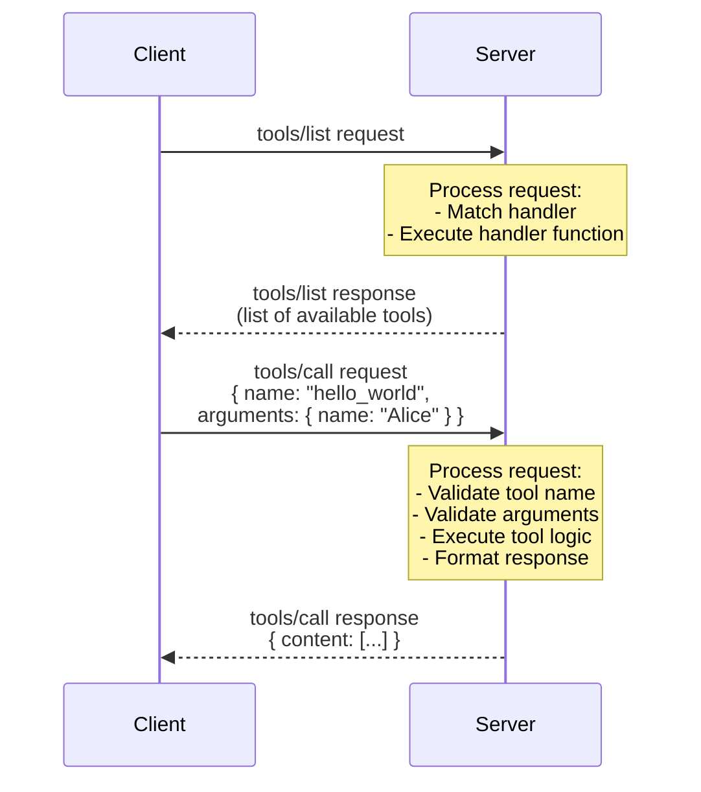

# Lab 2: Building Your First MCP Server

## Overview

Now that you understand the fundamentals of `MCP`, it's time to get hands-on! 

In this lab, you'll build a complete, working `MCP` server from scratch. You'll learn how to set up the project, implement the core protocol, and connect it to an `MCP` client.

---


## Learning Objectives

By the end of this lab, you will:

- Set up a Node.js / TypeScript project for `MCP` development
- Implement the `MCP` initialization handshake
- Create a basic server structure using the `MCP` SDK
- Test your server with a real `MCP` client
- Understand the request/response lifecycle
- Debug and troubleshoot common issues

---

## Prerequisites

Before starting, ensure you have:

- **Node.js** (v18 or later) installed
- **npm** or **yarn** package manager
- A code editor (**VS Code** recommended)
- Basic understanding of **JavaScript** / **TypeScript**
- Completed [Lab 1 - MCP Fundamentals](../Lab01-MCP-Fundamentals/index.md)

To verify your prerequisites are installed correctly, run the following commands:

```bash
# Check Node.js version
node --version

# Check yarn version
yarn --version

# Check npm version
npm --version

# Check JavaScript version (via Node.js V8 engine)
node -e "console.log('V8 version:', process.versions.v8)"

# Check VS Code version
code --version

```

---


## Project Setup

### Step 1: Initialize Your Project

- Create a new directory for your `MCP` server, navigate into it, and initialize a new Node.js project:

    ```bash
    mkdir my-first-mcp-server
    cd my-first-mcp-server
    npm init -y
    ```

### Step 2: Install Dependencies

- Install the MCP SDK and TypeScript dependencies using npm and build tool:

    ```bash
    # Core MCP SDK
    npm install @modelcontextprotocol/sdk

    # TypeScript and type definitions
    npm install -D typescript @types/node

    # Build tool
    npm install -D tsx
    ```

- To verify TypeScript installation:

    ```bash
    tsc --version
    ```

### Step 3: Configure TypeScript

- Create a `tsconfig.json` file:

    ```json
    {
      "compilerOptions": {
        "target": "ES2022",
        "module": "Node16",
        "moduleResolution": "Node16",
        "outDir": "./dist",
        "rootDir": "./src",
        "strict": true,
        "esModuleInterop": true,
        "skipLibCheck": true,
        "forceConsistentCasingInFileNames": true,
        "resolveJsonModule": true,
        "declaration": true
      },
      "include": ["src/**/*"],
      "exclude": ["node_modules", "dist"]
    }
    ```

### Step 4: Update package.json

- Replace (copy / paste) the entire content of the file `package.json`, located inside the previously created `my-first-mcp-server` directory, with the following content to add scripts and set module type:

    ```json
    {
      "name": "my-first-mcp-server",
      "version": "1.0.0",
      "type": "module",
      "description": "My first MCP server",
      "main": "dist/index.js",
      "scripts": {
        "build": "tsc",
        "dev": "tsx src/index.ts",
        "start": "node dist/index.js"
      },
      "keywords": ["mcp", "server"],
      "author": "Your Name"
    }
    ```


---


## Building the MCP Server

### Step 5: Create the Server Structure

- Create a directory named `src` inside `my-first-mcp-server`.
- Create a file named `index.ts` inside the `src` directory and fill it with the following basic server skeleton code (copy / paste inside the file):

    ```typescript
    #!/usr/bin/env node

    import { Server } from "@modelcontextprotocol/sdk/server/index.js";
    import { StdioServerTransport } from "@modelcontextprotocol/sdk/server/stdio.js";
    import {
      CallToolRequestSchema,
      ListToolsRequestSchema,
    } from "@modelcontextprotocol/sdk/types.js";

    /**
    * Create an MCP server with core capabilities
    */
    class MyFirstMCPServer {
      private server: Server;

      constructor() {
        this.server = new Server(
          {
            name: "my-first-mcp-server",
            version: "1.0.0",
          },
          {
            capabilities: {
              tools: {},
            },
          }
        );

        this.setupHandlers();
        this.setupErrorHandling();
      }

      /**
      * Set up request handlers
      */
      private setupHandlers(): void {
        // Handler for listing available tools
        this.server.setRequestHandler(
          ListToolsRequestSchema,
          async () => ({
            tools: [
              {
                name: "hello_world",
                description: "Returns a friendly greeting message",
                inputSchema: {
                  type: "object",
                  properties: {
                    name: {
                      type: "string",
                      description: "The name to greet",
                    },
                  },
                  required: ["name"],
                },
              },
            ],
          })
        );

        // Handler for calling tools
        this.server.setRequestHandler(
          CallToolRequestSchema,
          async (request) => {
            const { name, arguments: args } = request.params;

            if (name === "hello_world") {
              const userName = args?.name as string;
              
              if (!userName) {
                throw new Error("Name parameter is required");
              }

              return {
                content: [
                  {
                    type: "text",
                    text: `Hello, ${userName}! Welcome to your first MCP server! 🎉`,
                  },
                ],
              };
            }

            throw new Error(`Unknown tool: ${name}`);
          }
        );
      }

      /**
      * Set up error handling
      */
      private setupErrorHandling(): void {
        this.server.onerror = (error) => {
          console.error("[MCP Error]", error);
        };

        process.on("SIGINT", async () => {
          await this.server.close();
          process.exit(0);
        });
      }

      /**
      * Start the server
      */
      async start(): Promise<void> {
        const transport = new StdioServerTransport();
        await this.server.connect(transport);
        
        console.error("My First MCP Server running on stdio");
      }
    }

    /**
    * Main entry point
    */
    async function main() {
      const server = new MyFirstMCPServer();
      await server.start();
    }

    main().catch((error) => {
      console.error("Fatal error:", error);
      process.exit(1);
    });
    ```

## Understanding the Code

Let's break down the key components:

### 1. **Server Initialization**

```typescript
this.server = new Server(
  {
    name: "my-first-mcp-server",
    version: "1.0.0",
  },
  {
    capabilities: {
      tools: {},
    },
  }
);
```

- Defines server metadata (name and version)
- Declares capabilities (in this case, the server supports tools)
- This information is sent during the initialization handshake

### 2. **List Tools Handler**

```typescript
this.server.setRequestHandler(
  ListToolsRequestSchema,
  async () => ({
    tools: [...],
  })
);
```

- Responds to `tools/list` requests from clients
- Returns an array of tool definitions
- Each tool has: name, description and inputSchema (JSON Schema)

### 3. **Call Tool Handler**

```typescript
this.server.setRequestHandler(
  CallToolRequestSchema,
  async (request) => {
    // Tool execution logic
  }
);
```

- Responds to `tools/call` requests
- Receives tool name and arguments
- Returns tool results in a standardized format

### 4. **Transport Layer**

```typescript
const transport = new StdioServerTransport();
await this.server.connect(transport);
```

- Uses stdio (standard input/output) for communication
- Server runs as a subprocess of the client
- All `MCP` messages flow through stdin/stdout


---


## Testing Your Server

### Testing with the MCP Inspector

- The MCP Inspector is a web-based tool for testing MCP servers. Run these commands from your `my-first-mcp-server` directory:

    ```bash
    # Install the inspector globally
    npm install -g @modelcontextprotocol/inspector

    # Run your server with the inspector
    npx @modelcontextprotocol/inspector tsx src/index.ts
    ```

- This will open a web interface where you can:

    - See the server's capabilities
    - List available tools
    - Call tools with test inputs
    - View request/response messages

#### How to Test:

1. **Open the Inspector**: After running the command above, your default web browser should automatically open to the MCP Inspector interface (typically at `http://localhost:3000` or similar).

2. **Connect to the Server**: Look for a "Connect" button and click it. You should see a "Connected" status indicator. If the server fails to connect, check the terminal for error messages.

3. **List Tools**: Click on the "Tools" tab and then the "List Tools" button. You should see your `hello_world` tool appear in the list with its description and input schema. This confirms the server connection and capabilities.

4. **Call a Tool**: In the "Tools" tab, select the `hello_world` tool from the dropdown. Enter a name in the "name" field and click "Run Tool".

5. **View Results**: The response should appear below, showing the greeting message. Check the logs or response sections for any errors or debug information.

6. **Test Error Handling**: Try calling the tool without any input in the  "name" field to see how your server handles errors.

7. **Monitor Messages**: Check the response areas in the Tools tab or other sections to see details about the JSON-RPC messages being exchanged.


---


## The Request - Response Lifecycle

Here's what happens when a tool is called:




---


## Error Handling Best Practices

Proper error handling is crucial for `MCP` servers! 

Here's how to implement robust error handling, step by step:

### 1. **Validate Inputs**

**Why**: Always validate input parameters before processing to prevent runtime errors and provide clear feedback to clients.

**Step-by-step implementation**:

1. **Check for required parameters**:
   ```typescript
   if (!userName) {
     throw new Error("Name parameter is required");
   }
   ```

2. **Validate parameter types**:
   ```typescript
   if (typeof userName !== 'string') {
     throw new Error("Name parameter must be a string");
   }
   ```

3. **Combine validation checks**:
   ```typescript
   if (!userName || typeof userName !== 'string') {
     throw new Error("Name parameter is required and must be a string");
   }
   ```

4. **Validate against schema constraints**:
   ```typescript
   if (userName.length === 0) {
     throw new Error("Name parameter cannot be empty");
   }
   if (userName.length > 100) {
     throw new Error("Name parameter cannot exceed 100 characters");
   }
   ```

### 2. **Provide Helpful Error Messages**

**Why**: Clear error messages help developers understand what went wrong and how to fix it.

**Step-by-step implementation**:

1. **Include the problematic value in the error**:
   ```typescript
   throw new Error(`Unknown tool: ${name}`);
   ```

2. **Suggest available alternatives**:
   ```typescript
   throw new Error(`Unknown tool: ${name}. Available tools: hello_world`);
   ```

3. **Provide context about what was expected**:
   ```typescript
   throw new Error(`Invalid operation: ${operation}. Expected: add, subtract, multiply, or divide`);
   ```

4. **Include parameter names for clarity**:
   ```typescript
   throw new Error(`Parameter 'count' must be a positive number, got: ${count}`);
   ```

### 3. **Handle Async Errors**

**Why**: Asynchronous operations can fail, and these errors need to be caught and handled properly.

**Step-by-step implementation**:

1. **Wrap async operations in try-catch**:
   ```typescript
   try {
     const result = await someAsyncOperation();
     return { content: [{ type: "text", text: result }] };
   } catch (error) {
     // Handle the error
   }
   ```

2. **Extract error information safely**:
   ```typescript
   try {
     const result = await someAsyncOperation();
     return { content: [{ type: "text", text: result }] };
   } catch (error) {
     const errorMessage = error instanceof Error ? error.message : 'Unknown error occurred';
     throw new Error(`Operation failed: ${errorMessage}`);
   }
   ```

3. **Preserve original error context**:
   ```typescript
   try {
     const result = await someAsyncOperation();
     return { content: [{ type: "text", text: result }] };
   } catch (error) {
     console.error('Async operation failed:', error);
     throw new Error(`Operation failed: ${error.message}`);
   }
   ```

4. **Handle different error types appropriately**:
   ```typescript
   try {
     const result = await someAsyncOperation();
     return { content: [{ type: "text", text: result }] };
   } catch (error) {
     if (error.code === 'ENOTFOUND') {
       throw new Error('Network connection failed. Please check your internet connection.');
     } else if (error.code === 'ETIMEDOUT') {
       throw new Error('Operation timed out. Please try again.');
     } else {
       throw new Error(`Operation failed: ${error.message}`);
     }
   }
   ```

### 4. **Log to stderr**

**Why**: `MCP` protocol uses `stdout` for communication. Logging to `stdout` can break the protocol.

**Step-by-step implementation**:

1. **Use console.error() for all logging**:
   ```typescript
   console.error("[DEBUG] Tool called:", name);
   console.error("[DEBUG] Arguments:", args);
   ```

2. **Structure your log messages**:
   ```typescript
   console.error(`[INFO] Processing tool: ${name}`);
   console.error(`[DEBUG] Input validation passed`);
   console.error(`[ERROR] Tool execution failed:`, error.message);
   ```

3. **Log at appropriate levels**:
   ```typescript
   // Debug information
   console.error("[DEBUG] Server initialized with capabilities:", capabilities);

   // Info for normal operations
   console.error("[INFO] Tool executed successfully");

   // Warnings for potential issues
   console.error("[WARN] Using default value for optional parameter");

   // Errors for failures
   console.error("[ERROR] Tool execution failed:", error);
   ```

4. **Include timestamps for debugging**:
   ```typescript
   const timestamp = new Date().toISOString();
   console.error(`[${timestamp}] [INFO] Server started`);
   ```

!!! warning "**Important**"
    Use `console.error()` for logging, not `console.log()`. Your MCP server must not write to `stdout` for logging purposes, as
    stdout is reserved for MCP protocol messages!

---


## Common Issues and Solutions

### Issue 1: Server Not Connecting

- **Symptoms:** Client doesn't see the server or times out

- **Solutions:**

    - Check that the command path is absolute
    - Verify Node.js is in the PATH
    - Look at client logs for connection errors
    - Ensure the server starts without crashing

### Issue 2: Tools Not Appearing

- **Symptoms:** Server connects but no tools are listed

- **Solutions:**

    - Verify `capabilities.tools` is declared in server initialization
    - Check that `ListToolsRequestSchema` handler is registered
    - Ensure the handler returns the correct format
    - Restart the client after code changes

### Issue 3: Tool Execution Fails

- **Symptoms:** Tool appears but fails when called

- **Solutions:**

    - Validate input arguments match the schema
    - Check for typos in tool names
    - Add debug logging to see what's received
    - Ensure return format matches `MCP` specification

### Issue 4: Server Crashes

- **Symptoms:** Server exits unexpectedly

- **Solutions:**
  
    - Add try-catch blocks around async code
    - Check for unhandled promise rejections
    - Validate all external data
    - Add process error handlers

---


## Extending Your Server: Hands-On Exercises

Now that you have a working server, try these exercises:

### Exercise 1: Add a Calculator Tool

- Create a tool that performs basic math operations:

    ```typescript
    {
      name: "calculate",
      description: "Performs basic math operations",
      inputSchema: {
        type: "object",
        properties: {
          operation: {
            type: "string",
            enum: ["add", "subtract", "multiply", "divide"],
            description: "The operation to perform"
          },
          a: {
            type: "number",
            description: "First number"
          },
          b: {
            type: "number",
            description: "Second number"
          }
        },
        required: ["operation", "a", "b"]
      }
    }
    ```

### Exercise 2: Add an Echo Tool

- Create a tool that returns whatever text it receives:

    ```typescript
    {
      name: "echo",
      description: "Echoes back the input text",
      inputSchema: {
        type: "object",
        properties: {
          message: {
            type: "string",
            description: "The message to echo"
          },
          repeat: {
            type: "number",
            description: "Number of times to repeat (default: 1)",
            default: 1
          }
        },
        required: ["message"]
      }
    }
    ```

### Exercise 3: Add Logging

- Enhance your server with structured logging:

    ```typescript
    private log(level: string, message: string, data?: any): void {
      const timestamp = new Date().toISOString();
      const logEntry = { timestamp, level, message, data };
      console.error(JSON.stringify(logEntry));
    }
    ```

---


## Key Takeaways

✅ MCP servers are built using the `@modelcontextprotocol/sdk` package

✅ The SDK handles protocol details, letting you focus on business logic

✅ Servers communicate via stdio, HTTP, or custom transports

✅ Tools are defined with JSON Schema for type safety

✅ Error handling and validation are critical for reliability

✅ The MCP Inspector is invaluable for development and testing

✅ Always log to stderr, never stdout (reserved for protocol)


---


## Next Steps

In [**Lab 3**](../Lab03-MCP-Tools/), you'll dive deeper into implementing sophisticated MCP tools. 

- You'll learn:

    - Advanced input validation techniques
    - Returning rich content types (text, images, embedded resources)
    - Implementing async operations and long-running tasks
    - Error handling patterns
    - Tool composition and dependencies

---

## Additional Resources

- [MCP TypeScript SDK Documentation](https://github.com/modelcontextprotocol/typescript-sdk)
- [MCP Inspector Tool](https://github.com/modelcontextprotocol/inspector)
- [JSON Schema Reference](https://json-schema.org/)
- [MCP Protocol Specification](https://spec.modelcontextprotocol.io)

---


## Troubleshooting Checklist

- Before moving on, verify:

    - [ ] Your server builds without TypeScript errors
    - [ ] The server starts and logs "running on stdio"
    - [ ] The MCP Inspector can connect to your server
    - [ ] Tools appear in the inspector's tool list
    - [ ] You can successfully call the `hello_world` tool
    - [ ] Error messages are helpful and informative

---

**Congratulations! You've built your first MCP server! Ready for more? Continue to [**Lab 3**](../Lab03-MCP-Tools/)!**
