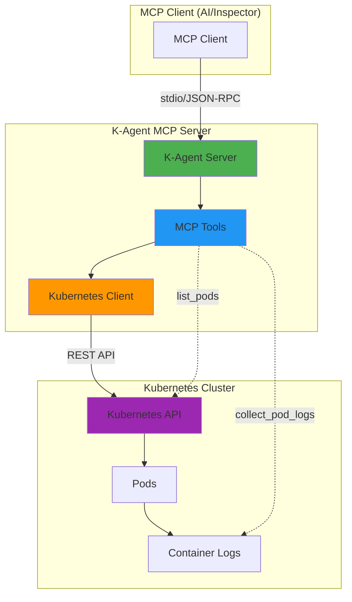

# Lab 08: K-Agent Integration

## Overview

- Welcome to the advanced MCP lab!

- Now that you've mastered the fundamentals of MCP servers, tools, resources, and prompts, it's time to apply your knowledge to a real-world scenario: **building and implementing a K-Agent**.

- A K-Agent is an MCP server specifically designed to interact with Kubernetes clusters.

- In this lab, you'll build a focused K-Agent that communicates with a Kubernetes cluster and collects logs from all pods - a critical capability for monitoring, debugging, and operational intelligence.

- This lab bridges the gap between MCP theory and practical Kubernetes operations, showing how MCP servers can enhance DevOps workflows and provide AI-powered insights into cluster health and application behavior.

---

## Learning Objectives

By the end of this lab, you will:

- Understand the concept and value of K-Agents (Kubernetes MCP servers)
- Use pre-configured Kubernetes cluster access
- Build MCP tools for pod log collection
- Implement error handling for cluster operations

---

## Prerequisites

- Completed [Lab 5 - MCP Prompts and Integration](../Lab05-MCP-Prompts/)
- **A running Kubernetes cluster** (OrbStack, Docker Desktop, Minikube, kind, or remote cluster)
- **kubectl installed and configured** with access to your cluster (`kubectl cluster-info` should work)
- Basic understanding of Kubernetes concepts (pods, namespaces, kubectl)
- Familiarity with container orchestration principles
- Understanding of log aggregation and monitoring concepts

!!! debug "Verify Kubernetes Setup"

    * Before starting this lab, ensure your Kubernetes environment is ready:

          ```bash
          # Check cluster access
          kubectl cluster-info

          # Verify you can list pods
          kubectl get pods --all-namespaces

          # Check your kubeconfig
          kubectl config view
          ```

---

## What is a K-Agent?

A `**K-Agent**` is an `MCP server` that specializes in Kubernetes operations.

Unlike generic MCP servers, K-Agents are designed specifically for:

- **Cluster Communication**: Secure, authenticated access to Kubernetes APIs
- **Operational Intelligence**: Real-time insights into cluster health and performance
- **Log Analytics**: Collection and analysis of application and system logs
- **Resource Management**: Monitoring and managing Kubernetes resources
- **Troubleshooting**: Automated diagnosis of cluster and application issues

---

### Why K-Agents Matter

- In modern DevOps environments, Kubernetes clusters generate enormous amounts of operational data.

K-Agents provide:

- **AI-Powered Monitoring**: Intelligent analysis of logs and metrics
- **Automated Troubleshooting**: AI-assisted diagnosis of issues
- **Operational Insights**: Pattern recognition in cluster behavior
- **Enhanced Observability**: Structured access to distributed system data
- **Seamless Integration**: MCP tools that interact directly with Kubernetes resources
- **Improved DevOps Workflows**: Streamlined operations through AI-driven tools
- **Dashboarding and Alerts**: Proactive monitoring with AI-generated alerts
- **Custom Tooling**: Tailored MCP tools for specific Kubernetes tasks

---

## Lab Architecture

Your K-Agent will implement a focused set of capabilities:



---

### Core Components

1.  **Kubernetes Client Integration**
    - Secure cluster authentication
    - API communication handling
    - Error management for cluster operations

2.  **Log Collection Tools**
    - Pod discovery across namespaces
    - Log retrieval from all containers
    - Structured log formatting

3.  **Resource Management**
    - Namespace enumeration
    - Pod status monitoring
    - Health check capabilities

---

## Hands-On Exercise

### Step 1: Project Setup

Create a new MCP server project with Kubernetes dependencies:

```bash
# Create project directory and navigate to it
mkdir k-agent-logs
cd k-agent-logs
```

<br>

- Create a new `package.json` file inside the `k-agent-logs` directory with the following content:

```json
{
  "name": "k-agent-logs",
  "version": "1.0.0",
  "description": "K-Agent MCP server for Kubernetes log collection",
  "main": "dist/index.js",
  "scripts": {
    "build": "tsc",
    "dev": "tsx src/index.ts",
    "start": "node dist/index.js"
  },
  "keywords": ["kubernetes", "mcp", "logs", "monitoring"],
  "author": "",
  "license": "ISC",
  "type": "commonjs",
  "dependencies": {
    "@kubernetes/client-node": "^1.4.0",
    "@modelcontextprotocol/sdk": "^1.25.2"
  },
  "devDependencies": {
    "@types/node": "^25.0.3",
    "tsx": "^4.21.0",
    "typescript": "^5.9.3"
  }
}
```

---

- Run the following command to install the dependencies:

```bash
npm install
```

This will create `node_modules/` and `package-lock.json` in your `k-agent-logs` directory.

---

### Step 2: Kubernetes Client Configuration & Complete Server Setup

Create an `src` directory, inside the `k-agent-logs` directory, and an empty file named `index.ts` inside it:

```bash
mkdir -p src && touch src/index.ts
```

<br>

Create your complete K-Agent server by pasting the following code inside `src/index.ts`:

```typescript
// Import MCP SDK components and Kubernetes client
import { Server } from "@modelcontextprotocol/sdk/server/index.js";
import { StdioServerTransport } from "@modelcontextprotocol/sdk/server/stdio.js";
import {
  CallToolRequestSchema,
  ErrorCode,
  ListResourcesRequestSchema,
  ListToolsRequestSchema,
  McpError,
  ReadResourceRequestSchema,
} from "@modelcontextprotocol/sdk/types.js";
import * as k8s from "@kubernetes/client-node";

class KAgentServer {
  // Store Kubernetes API clients (for talking to your cluster)
  private k8sConfig: k8s.KubeConfig;
  private k8sAppsApi: k8s.AppsV1Api;
  private k8sCoreApi: k8s.CoreV1Api;
  private server: Server;

  constructor() {
    // Initialize connection to your Kubernetes cluster (uses ~/.kube/config)
    this.k8sConfig = new k8s.KubeConfig();
    this.k8sConfig.loadFromDefault();

    this.k8sAppsApi = this.k8sConfig.makeApiClient(k8s.AppsV1Api);
    this.k8sCoreApi = this.k8sConfig.makeApiClient(k8s.CoreV1Api);

    // Create MCP server that AI tools can connect to
    this.server = new Server(
      {
        name: "k-agent-logs",
        version: "1.0.0",
      },
      {
        capabilities: {
          tools: {},
          resources: {},
        },
      },
    );

    // Handle incoming MCP requests (you'll add tools here next)
    this.setupHandlers();
  }

  private setupHandlers() {
    // TODO: Implement MCP handlers
  }

  // Start the server and listen for connections
  async run() {
    const transport = new StdioServerTransport();
    await this.server.connect(transport);
    console.error("K-Agent MCP server running on stdio");
  }
}

// Actually run the server
const server = new KAgentServer();
server.run().catch(console.error);
```

<br>

Create a file named `tsconfig.json` inside the `k-agent-logs` directory (not inside `src`):

```bash
cd ..  # Go back to k-agent-logs directory
touch tsconfig.json
```

<br>

Paste the following content into `tsconfig.json`:

```json
{
  "compilerOptions": {
    "target": "ES2022",
    "module": "commonjs",
    "lib": ["ES2022"],
    "outDir": "./dist",
    "rootDir": "./src",
    "strict": true,
    "esModuleInterop": true,
    "skipLibCheck": true,
    "forceConsistentCasingInFileNames": true,
    "resolveJsonModule": true,
    "declaration": true,
    "declarationMap": true,
    "sourceMap": true
  },
  "include": ["src/**/*"],
  "exclude": ["node_modules", "dist"]
}
```

<br>

**Test that it works:**

```bash
npm run dev
```

You should see: `K-Agent MCP server running on stdio`

<br>

!!! warning "If you get errors:" - `Missing script: "dev"` → You didn't update package.json (go back to step 2) - `Cannot find module` → Make sure you're in the k-agent-logs directory - Other errors → Check that src/index.ts has the correct code

---

### Step 3: Pod Discovery Tool

Implement pod enumeration across namespaces with the `list_pods` tool.

<br>

#### Update setupHandlers() Method

Open your `src/index.ts` file and find the `setupHandlers()` method. Replace the entire method with the following code:

```typescript
private setupHandlers() {
  // List available tools
  this.server.setRequestHandler(ListToolsRequestSchema, async () => {
    return {
      tools: [
        {
          name: "list_pods",
          description: "List all pods across namespaces with their status",
          inputSchema: {
            type: "object",
            properties: {
              namespace: {
                type: "string",
                description: "Optional: Filter by specific namespace"
              }
            }
          }
        }
      ]
    };
  });

  // Handle tool calls
  this.server.setRequestHandler(CallToolRequestSchema, async (request) => {
    const { name, arguments: args } = request.params;

    try {
      switch (name) {
        case "list_pods":
          return await this.handleListPods(args);
        default:
          throw new McpError(
            ErrorCode.MethodNotFound,
            `Unknown tool: ${name}`
          );
      }
    } catch (error) {
      throw new McpError(
        ErrorCode.InternalError,
        `Tool execution failed: ${error instanceof Error ? error.message : String(error)}`
      );
    }
  });
}
```

<br>

#### Add Handler Methods

Below the `setupHandlers()` method, **before the `async run()` method**, add the following new methods:

```typescript
private async handleListPods(args: any) {
  const namespace = args?.namespace;
  const pods = await this.getPods(namespace);

  const podList = pods.map(pod => ({
    name: pod.metadata?.name || 'unknown',
    namespace: pod.metadata?.namespace || 'unknown',
    status: pod.status?.phase || 'unknown',
    containers: pod.spec?.containers?.map(c => c.name) || []
  }));

  return {
    content: [
      {
        type: "text",
        text: JSON.stringify(podList, null, 2)
      }
    ]
  };
}

private async getPods(namespace?: string): Promise<k8s.V1Pod[]> {
  try {
    if (namespace) {
      const response = await this.k8sCoreApi.listNamespacedPod({ namespace });
      return response.items || [];
    } else {
      const response = await this.k8sCoreApi.listPodForAllNamespaces();
      return response.items || [];
    }
  } catch (error) {
    throw this.handleK8sError(error);
  }
}

private handleK8sError(error: any): Error {
  if (error.response?.statusCode === 403) {
    return new Error('Access denied: Insufficient permissions to access Kubernetes resources');
  }

  if (error.response?.statusCode === 404) {
    return new Error('Resource not found: The specified pod or namespace may not exist');
  }

  return new Error(`Kubernetes operation failed: ${error.message}`);
}
```

<br>

!!! success "Complete `src/index.ts` After Step 3"
Here's what your complete `src/index.ts` file should look like after completing Step 3:

    ```typescript
    // Import MCP SDK components and Kubernetes client
    import { Server } from "@modelcontextprotocol/sdk/server/index.js";
    import { StdioServerTransport } from "@modelcontextprotocol/sdk/server/stdio.js";
    import {
      CallToolRequestSchema,
      ErrorCode,
      ListResourcesRequestSchema,
      ListToolsRequestSchema,
      McpError,
      ReadResourceRequestSchema,
    } from "@modelcontextprotocol/sdk/types.js";
    import * as k8s from '@kubernetes/client-node';

    class KAgentServer {
      // Store Kubernetes API clients (for talking to your cluster)
      private k8sConfig: k8s.KubeConfig;
      private k8sAppsApi: k8s.AppsV1Api;
      private k8sCoreApi: k8s.CoreV1Api;
      private server: Server;

      constructor() {
        // Initialize connection to your Kubernetes cluster (uses ~/.kube/config)
        this.k8sConfig = new k8s.KubeConfig();
        this.k8sConfig.loadFromDefault();

        this.k8sAppsApi = this.k8sConfig.makeApiClient(k8s.AppsV1Api);
        this.k8sCoreApi = this.k8sConfig.makeApiClient(k8s.CoreV1Api);

        // Create MCP server that AI tools can connect to
        this.server = new Server(
          {
            name: "k-agent-logs",
            version: "1.0.0",
          },
          {
            capabilities: {
              tools: {},
              resources: {},
            },
          }
        );

        // Handle incoming MCP requests
        this.setupHandlers();
      }

      private setupHandlers() {
        // List available tools
        this.server.setRequestHandler(ListToolsRequestSchema, async () => {
          return {
            tools: [
              {
                name: "list_pods",
                description: "List all pods across namespaces with their status",
                inputSchema: {
                  type: "object",
                  properties: {
                    namespace: {
                      type: "string",
                      description: "Optional: Filter by specific namespace"
                    }
                  }
                }
              }
            ]
          };
        });

        // Handle tool calls
        this.server.setRequestHandler(CallToolRequestSchema, async (request) => {
          const { name, arguments: args } = request.params;

          try {
            switch (name) {
              case "list_pods":
                return await this.handleListPods(args);
              default:
                throw new McpError(
                  ErrorCode.MethodNotFound,
                  `Unknown tool: ${name}`
                );
            }
          } catch (error) {
            throw new McpError(
              ErrorCode.InternalError,
              `Tool execution failed: ${error instanceof Error ? error.message : String(error)}`
            );
          }
        });
      }

      private async handleListPods(args: any) {
        const namespace = args?.namespace;
        const pods = await this.getPods(namespace);

        const podList = pods.map(pod => ({
          name: pod.metadata?.name || 'unknown',
          namespace: pod.metadata?.namespace || 'unknown',
          status: pod.status?.phase || 'unknown',
          containers: pod.spec?.containers?.map(c => c.name) || []
        }));

        return {
          content: [
            {
              type: "text",
              text: JSON.stringify(podList, null, 2)
            }
          ]
        };
      }

      private async getPods(namespace?: string): Promise<k8s.V1Pod[]> {
        try {
          if (namespace) {
            const response = await this.k8sCoreApi.listNamespacedPod({ namespace });
            return response.items || [];
          } else {
            const response = await this.k8sCoreApi.listPodForAllNamespaces();
            return response.items || [];
          }
        } catch (error) {
          throw this.handleK8sError(error);
        }
      }

      private handleK8sError(error: any): Error {
        if (error.response?.statusCode === 403) {
          return new Error('Access denied: Insufficient permissions to access Kubernetes resources');
        }

        if (error.response?.statusCode === 404) {
          return new Error('Resource not found: The specified pod or namespace may not exist');
        }

        return new Error(`Kubernetes operation failed: ${error.message}`);
      }

      // Start the server and listen for connections
      async run() {
        const transport = new StdioServerTransport();
        await this.server.connect(transport);
        console.error("K-Agent MCP server running on stdio");
      }
    }

    // Actually run the server
    const server = new KAgentServer();
    server.run().catch(console.error);
    ```

<br>

#### Test Pod Discovery

Test the pod listing functionality using the MCP Inspector by running:

```bash
npx @modelcontextprotocol/inspector node_modules/.bin/tsx src/index.ts
```

This will start the MCP Inspector connected to your K-Agent server and open a browser window.

**Inside the MCP Inspector UI browser window:**

1. Click the **"Connect"** button
2. Click the **"Tools"** tab
3. Click **"List Tools"** - you'll see the `list_pods` tool
4. Click on **`list_pods`**
5. Optionally enter a namespace name
6. Click **"Run Tool"** to test it

You should see a JSON list of all pods with their status and container names.

---

### Step 4: Log Collection Tool

Build the core log collection functionality with the `collect_pod_logs` tool.

<br>

#### Add collect_pod_logs to Tools Array

In your `src/index.ts` file, locate the tools array inside `setupHandlers()` method.

Add the following second tool code to the array:

```typescript
private setupHandlers() {
  // List available tools
  this.server.setRequestHandler(ListToolsRequestSchema, async () => {
    return {
      tools: [
        {
          name: "list_pods",
          description: "List all pods across namespaces with their status",
          inputSchema: {
            type: "object",
            properties: {
              namespace: {
                type: "string",
                description: "Optional: Filter by specific namespace"
              }
            }
          }
        },
        {
          name: "collect_pod_logs",
          description: "Collect logs from all containers in specified pods",
          inputSchema: {
            type: "object",
            properties: {
              namespace: {
                type: "string",
                description: "Namespace to collect logs from"
              },
              podName: {
                type: "string",
                description: "Specific pod name (optional - collects from all if not specified)"
              },
              tailLines: {
                type: "number",
                description: "Number of recent log lines to retrieve",
                default: 100
              }
            },
            required: ["namespace"]
          }
        }
      ]
    };
  });
  // ... rest of setupHandlers
}
```

<br>

#### Update Tool Handler Switch

In the same `setupHandlers()` method, locate the switch statement and add the following case for `collect_pod_logs`:

```typescript
switch (name) {
  case "list_pods":
    return await this.handleListPods(args);
  case "collect_pod_logs":
    return await this.handleCollectPodLogs(args);
  default:
    throw new McpError(ErrorCode.MethodNotFound, `Unknown tool: ${name}`);
}
```

<br>

#### Implement Log Collection Methods

Below your existing handler methods (after `handleK8sError()`), **before the `async run()` method**, add the following new methods:

```typescript
private async handleCollectPodLogs(args: any) {
  const { namespace, podName, tailLines = 100 } = args;

  if (!namespace) {
    throw new Error("Namespace is required");
  }

  const logs = await this.collectPodLogs(namespace, podName, tailLines);

  return {
    content: [
      {
        type: "text",
        text: logs
      }
    ]
  };
}

private async collectPodLogs(namespace: string, podName?: string, tailLines: number = 100): Promise<string> {
  const pods = podName
    ? await this.getPods(namespace).then(pods => pods.filter(p => p.metadata?.name === podName))
    : await this.getPods(namespace);

  const allLogs: string[] = [];

  for (const pod of pods) {
    if (!pod.metadata?.name) continue;

    const containers = pod.spec?.containers || [];
    for (const container of containers) {
      try {
        const logs = await this.getPodLogs(namespace, pod.metadata.name, container.name, tailLines);
        allLogs.push(`=== ${pod.metadata.name}/${container.name} ===\n${logs}\n`);
      } catch (error) {
        allLogs.push(`=== ${pod.metadata.name}/${container.name} ===\nError retrieving logs: ${error instanceof Error ? error.message : String(error)}\n`);
      }
    }
  }

  return allLogs.join('\n');
}

private async getPodLogs(namespace: string, podName: string, containerName: string, tailLines: number): Promise<string> {
  try {
    const response = await this.k8sCoreApi.readNamespacedPodLog({
      name: podName,
      namespace: namespace,
      container: containerName,
      tailLines: tailLines,
      timestamps: true
    });
    return response || '';
  } catch (error) {
    throw this.handleK8sError(error);
  }
}
```

!!! success "Complete `src/index.ts` After Step 4"
Here's what your complete `src/index.ts` file should look like after completing Step 4:

    ```typescript
    // Import MCP SDK components and Kubernetes client
    import { Server } from "@modelcontextprotocol/sdk/server/index.js";
    import { StdioServerTransport } from "@modelcontextprotocol/sdk/server/stdio.js";
    import {
      CallToolRequestSchema,
      ErrorCode,
      ListResourcesRequestSchema,
      ListToolsRequestSchema,
      McpError,
      ReadResourceRequestSchema,
    } from "@modelcontextprotocol/sdk/types.js";
    import * as k8s from '@kubernetes/client-node';

    class KAgentServer {
      // Store Kubernetes API clients (for talking to your cluster)
      private k8sConfig: k8s.KubeConfig;
      private k8sAppsApi: k8s.AppsV1Api;
      private k8sCoreApi: k8s.CoreV1Api;
      private server: Server;

      constructor() {
        // Initialize connection to your Kubernetes cluster (uses ~/.kube/config)
        this.k8sConfig = new k8s.KubeConfig();
        this.k8sConfig.loadFromDefault();

        this.k8sAppsApi = this.k8sConfig.makeApiClient(k8s.AppsV1Api);
        this.k8sCoreApi = this.k8sConfig.makeApiClient(k8s.CoreV1Api);

        // Create MCP server that AI tools can connect to
        this.server = new Server(
          {
            name: "k-agent-logs",
            version: "1.0.0",
          },
          {
            capabilities: {
              tools: {},
              resources: {},
            },
          }
        );

        // Handle incoming MCP requests
        this.setupHandlers();
      }

      private setupHandlers() {
        // List available tools
        this.server.setRequestHandler(ListToolsRequestSchema, async () => {
          return {
            tools: [
              {
                name: "list_pods",
                description: "List all pods across namespaces with their status",
                inputSchema: {
                  type: "object",
                  properties: {
                    namespace: {
                      type: "string",
                      description: "Optional: Filter by specific namespace"
                    }
                  }
                }
              },
              {
                name: "collect_pod_logs",
                description: "Collect logs from all containers in specified pods",
                inputSchema: {
                  type: "object",
                  properties: {
                    namespace: {
                      type: "string",
                      description: "Namespace to collect logs from"
                    },
                    podName: {
                      type: "string",
                      description: "Specific pod name (optional - collects from all if not specified)"
                    },
                    tailLines: {
                      type: "number",
                      description: "Number of recent log lines to retrieve",
                      default: 100
                    }
                  },
                  required: ["namespace"]
                }
              }
            ]
          };
        });

        // Handle tool calls
        this.server.setRequestHandler(CallToolRequestSchema, async (request) => {
          const { name, arguments: args } = request.params;

          try {
            switch (name) {
              case "list_pods":
                return await this.handleListPods(args);
              case "collect_pod_logs":
                return await this.handleCollectPodLogs(args);
              default:
                throw new McpError(
                  ErrorCode.MethodNotFound,
                  `Unknown tool: ${name}`
                );
            }
          } catch (error) {
            throw new McpError(
              ErrorCode.InternalError,
              `Tool execution failed: ${error instanceof Error ? error.message : String(error)}`
            );
          }
        });
      }

      private async handleListPods(args: any) {
        const namespace = args?.namespace;
        const pods = await this.getPods(namespace);

        const podList = pods.map(pod => ({
          name: pod.metadata?.name || 'unknown',
          namespace: pod.metadata?.namespace || 'unknown',
          status: pod.status?.phase || 'unknown',
          containers: pod.spec?.containers?.map(c => c.name) || []
        }));

        return {
          content: [
            {
              type: "text",
              text: JSON.stringify(podList, null, 2)
            }
          ]
        };
      }

      private async handleCollectPodLogs(args: any) {
        const { namespace, podName, tailLines = 100 } = args;

        if (!namespace) {
          throw new Error("Namespace is required");
        }

        const logs = await this.collectPodLogs(namespace, podName, tailLines);

        return {
          content: [
            {
              type: "text",
              text: logs
            }
          ]
        };
      }

      private async collectPodLogs(namespace: string, podName?: string, tailLines: number = 100): Promise<string> {
        const pods = podName
          ? await this.getPods(namespace).then(pods => pods.filter(p => p.metadata?.name === podName))
          : await this.getPods(namespace);

        const allLogs: string[] = [];

        for (const pod of pods) {
          if (!pod.metadata?.name) continue;

          const containers = pod.spec?.containers || [];
          for (const container of containers) {
            try {
              const logs = await this.getPodLogs(namespace, pod.metadata.name, container.name, tailLines);
              allLogs.push(`=== ${pod.metadata.name}/${container.name} ===\n${logs}\n`);
            } catch (error) {
              allLogs.push(`=== ${pod.metadata.name}/${container.name} ===\nError retrieving logs: ${error instanceof Error ? error.message : String(error)}\n`);
            }
          }
        }

        return allLogs.join('\n');
      }

      private async getPods(namespace?: string): Promise<k8s.V1Pod[]> {
        try {
          if (namespace) {
            const response = await this.k8sCoreApi.listNamespacedPod({ namespace });
            return response.items || [];
          } else {
            const response = await this.k8sCoreApi.listPodForAllNamespaces();
            return response.items || [];
          }
        } catch (error) {
          throw this.handleK8sError(error);
        }
      }

      private async getPodLogs(namespace: string, podName: string, containerName: string, tailLines: number): Promise<string> {
        try {
          const response = await this.k8sCoreApi.readNamespacedPodLog({
            name: podName,
            namespace: namespace,
            container: containerName,
            tailLines: tailLines,
            timestamps: true
          });
          return response || '';
        } catch (error) {
          throw this.handleK8sError(error);
        }
      }

      private handleK8sError(error: any): Error {
        if (error.response?.statusCode === 403) {
          return new Error('Access denied: Insufficient permissions to access Kubernetes resources');
        }

        if (error.response?.statusCode === 404) {
          return new Error('Resource not found: The specified pod or namespace may not exist');
        }

        return new Error(`Kubernetes operation failed: ${error.message}`);
      }

      // Start the server and listen for connections
      async run() {
        const transport = new StdioServerTransport();
        await this.server.connect(transport);
        console.error("K-Agent MCP server running on stdio");
      }
    }

    // Actually run the server
    const server = new KAgentServer();
    server.run().catch(console.error);
    ```

<br>

#### Test Log Collection

Test the log collection functionality with the MCP Inspector:

```bash
npx @modelcontextprotocol/inspector node_modules/.bin/tsx src/index.ts
```

This will start the MCP Inspector connected to your K-Agent server and open a browser window.

**In the MCP Inspector UI browser window:**

1. Click the **"Connect"** button
2. Click the **"Tools"** tab
3. Click **"List Tools"** - you'll see both `list_pods` and `collect_pod_logs`
4. Click on **`collect_pod_logs`**
5. In the **namespace** field, enter: `default`
6. Click **"Run Tool"**

You should see logs from all pods in the default namespace, formatted with pod and container names.

---

## Optional Extensions

!!! info "Prerequisites"
These exercises assume you have completed **Steps 1-4** and have a fully functional K-Agent server with `list_pods` and `collect_pod_logs` tools. These exercises extend the functionality beyond the core implementation.

---

### Exercise 1: Advanced Pod Filtering and Sorting

Enhance the `list_pods` tool to support filtering by status, labels, and sorting by various criteria.

**Update the list_pods tool schema** in your `setupHandlers()` method to include new parameters:

```typescript
{
  name: "list_pods",
  description: "List all pods across namespaces with their status, with filtering and sorting options",
  inputSchema: {
    type: "object",
    properties: {
      namespace: {
        type: "string",
        description: "Optional: Filter by specific namespace"
      },
      status: {
        type: "string",
        description: "Optional: Filter by pod status (Running, Pending, Failed, etc.)",
        enum: ["Running", "Pending", "Failed", "Succeeded", "Unknown"]
      },
      labelSelector: {
        type: "string",
        description: "Optional: Filter by label selector (e.g., 'app=nginx,env=prod')"
      },
      sortBy: {
        type: "string",
        description: "Sort results by field",
        enum: ["name", "namespace", "status", "age"],
        default: "name"
      }
    }
  }
}
```

<br>

**Update the handleListPods method** to support the new parameters:

```typescript
private async handleListPods(args: any) {
  const { namespace, status, labelSelector, sortBy = 'name' } = args;
  let pods = await this.getPods(namespace, labelSelector);

  // Filter by status if specified
  if (status) {
    pods = pods.filter(pod => pod.status?.phase === status);
  }

  // Map to simplified format
  const podList = pods.map(pod => ({
    name: pod.metadata?.name || 'unknown',
    namespace: pod.metadata?.namespace || 'unknown',
    status: pod.status?.phase || 'unknown',
    containers: pod.spec?.containers?.map(c => c.name) || [],
    age: pod.metadata?.creationTimestamp
      ? Math.floor((Date.now() - new Date(pod.metadata.creationTimestamp).getTime()) / 1000 / 60)
      : 0,
    labels: pod.metadata?.labels || {}
  }));

  // Sort results
  const sortedPods = this.sortPods(podList, sortBy);

  return {
    content: [
      {
        type: "text",
        text: JSON.stringify(sortedPods, null, 2)
      }
    ]
  };
}
```

<br>

**Update the getPods method** to support label selectors:

```typescript
private async getPods(namespace?: string, labelSelector?: string): Promise<k8s.V1Pod[]> {
  try {
    if (namespace) {
      const response = await this.k8sCoreApi.listNamespacedPod({
        namespace,
        labelSelector
      });
      return response.items || [];
    } else {
      const response = await this.k8sCoreApi.listPodForAllNamespaces({
        labelSelector
      });
      return response.items || [];
    }
  } catch (error) {
    throw this.handleK8sError(error);
  }
}
```

<br>

**Add a sorting helper method** after the `getPods` method:

```typescript
private sortPods(pods: any[], sortBy: string): any[] {
  return pods.sort((a, b) => {
    switch (sortBy) {
      case 'namespace':
        return a.namespace.localeCompare(b.namespace);
      case 'status':
        return a.status.localeCompare(b.status);
      case 'age':
        return b.age - a.age; // Newest first
      case 'name':
      default:
        return a.name.localeCompare(b.name);
    }
  });
}
```

<br>

**Test the enhanced filtering:**

```bash
npx @modelcontextprotocol/inspector node_modules/.bin/tsx src/index.ts
```

**Try these test cases:**

- List only Running pods: Set `status` to "Running"
- Filter by labels: Set `labelSelector` to "app=nginx"
- Sort by age: Set `sortBy` to "age"
- Combine filters: Use namespace + status + sortBy together

---

### Exercise 2: Enhanced Log Analysis with Search and Export

Extend the `collect_pod_logs` tool to support log searching, filtering by severity, and exporting logs to files.

**Add a new tool `analyze_logs`** to your tools array in `setupHandlers()`:

```typescript
{
  name: "analyze_logs",
  description: "Analyze and search through pod logs with filtering and export capabilities",
  inputSchema: {
    type: "object",
    properties: {
      namespace: {
        type: "string",
        description: "Namespace to analyze logs from"
      },
      podName: {
        type: "string",
        description: "Specific pod name (optional)"
      },
      searchPattern: {
        type: "string",
        description: "Regex pattern to search for in logs"
      },
      severityLevel: {
        type: "string",
        description: "Filter by log severity",
        enum: ["ERROR", "WARN", "INFO", "DEBUG"]
      },
      tailLines: {
        type: "number",
        description: "Number of recent log lines to analyze",
        default: 100
      },
      exportToFile: {
        type: "boolean",
        description: "Export matching logs to a file",
        default: false
      }
    },
    required: ["namespace"]
  }
}
```

<br>

**Add the case to your switch statement:**

```typescript
case "analyze_logs":
  return await this.handleAnalyzeLogs(args);
```

<br>

**Implement the log analysis handler** after your `handleCollectPodLogs` method:

```typescript
private async handleAnalyzeLogs(args: any) {
  const { namespace, podName, searchPattern, severityLevel, tailLines = 100, exportToFile = false } = args;

  if (!namespace) {
    throw new Error("Namespace is required");
  }

  const logs = await this.collectPodLogs(namespace, podName, tailLines);
  const analyzedLogs = this.analyzeLogs(logs, searchPattern, severityLevel);

  if (exportToFile) {
    const filename = await this.exportLogs(analyzedLogs, namespace, podName);
    return {
      content: [
        {
          type: "text",
          text: `Analysis complete. ${analyzedLogs.totalLines} lines analyzed, ${analyzedLogs.matchingLines} matches found.\nExported to: ${filename}\n\n${analyzedLogs.summary}`
        }
      ]
    };
  }

  return {
    content: [
      {
        type: "text",
        text: `Analysis Results:\n${analyzedLogs.summary}\n\nMatching Logs:\n${analyzedLogs.matches.join('\n')}`
      }
    ]
  };
}
```

<br>

**Add the log analysis helper method:**

```typescript
private analyzeLogs(logs: string, searchPattern?: string, severityLevel?: string) {
  const lines = logs.split('\n');
  const matches: string[] = [];
  const errors: string[] = [];
  const warnings: string[] = [];

  for (const line of lines) {
    // Filter by severity if specified
    if (severityLevel) {
      if (!line.includes(severityLevel)) continue;
    }

    // Search for pattern if specified
    if (searchPattern) {
      const regex = new RegExp(searchPattern, 'i');
      if (regex.test(line)) {
        matches.push(line);
      }
    } else {
      matches.push(line);
    }

    // Categorize by severity
    if (line.includes('ERROR') || line.includes('error')) {
      errors.push(line);
    } else if (line.includes('WARN') || line.includes('warning')) {
      warnings.push(line);
    }
  }

  const summary = [
    `Total Lines: ${lines.length}`,
    `Matching Lines: ${matches.length}`,
    `Errors Found: ${errors.length}`,
    `Warnings Found: ${warnings.length}`,
    searchPattern ? `Search Pattern: ${searchPattern}` : '',
    severityLevel ? `Severity Filter: ${severityLevel}` : ''
  ].filter(Boolean).join('\n');

  return {
    totalLines: lines.length,
    matchingLines: matches.length,
    matches: matches.slice(0, 100), // Limit to first 100 matches
    errors,
    warnings,
    summary
  };
}
```

<br>

**Add the export helper method** (requires fs module - add `import * as fs from 'fs';` at the top):

```typescript
private async exportLogs(analyzedLogs: any, namespace: string, podName?: string): Promise<string> {
  const timestamp = new Date().toISOString().replace(/[:.]/g, '-');
  const filename = `logs_${namespace}_${podName || 'all'}_${timestamp}.txt`;
  const filepath = `/tmp/${filename}`;

  const content = [
    `Kubernetes Log Analysis Report`,
    `Generated: ${new Date().toISOString()}`,
    `Namespace: ${namespace}`,
    podName ? `Pod: ${podName}` : 'All Pods',
    ``,
    analyzedLogs.summary,
    ``,
    `=== Matching Log Entries ===`,
    analyzedLogs.matches.join('\n')
  ].join('\n');

  // Note: In a real implementation, you'd want to handle file system operations more carefully
  // For this exercise, we'll just return the intended filename
  return filepath;
}
```

<br>

**Test the log analysis:**

```bash
npx @modelcontextprotocol/inspector node_modules/.bin/tsx src/index.ts
```

**Try these test cases:**

- Search for errors: Set `searchPattern` to "error" and `severityLevel` to "ERROR"
- Find warnings: Set `severityLevel` to "WARN"
- Export logs: Set `exportToFile` to true
- Pattern matching: Set `searchPattern` to a specific error code or message

---

### Exercise 3: Real-Time Pod Monitoring

Create a new tool to monitor pod health and events in real-time, providing insights into pod lifecycle changes.

**Add the `monitor_pod_health` tool** to your tools array:

```typescript
{
  name: "monitor_pod_health",
  description: "Monitor pod health, restart counts, and recent events",
  inputSchema: {
    type: "object",
    properties: {
      namespace: {
        type: "string",
        description: "Namespace to monitor"
      },
      podName: {
        type: "string",
        description: "Specific pod to monitor (optional)"
      },
      includeEvents: {
        type: "boolean",
        description: "Include recent Kubernetes events",
        default: true
      }
    },
    required: ["namespace"]
  }
}
```

<br>

**Add the case to your switch statement:**

```typescript
case "monitor_pod_health":
  return await this.handleMonitorPodHealth(args);
```

<br>

**Implement the monitoring handler:**

```typescript
private async handleMonitorPodHealth(args: any) {
  const { namespace, podName, includeEvents = true } = args;

  if (!namespace) {
    throw new Error("Namespace is required");
  }

  const pods = podName
    ? await this.getPods(namespace).then(pods => pods.filter(p => p.metadata?.name === podName))
    : await this.getPods(namespace);

  const healthReports = [];

  for (const pod of pods) {
    if (!pod.metadata?.name) continue;

    const health = this.analyzePodHealth(pod);
    const events = includeEvents
      ? await this.getPodEvents(namespace, pod.metadata.name)
      : [];

    healthReports.push({
      pod: pod.metadata.name,
      namespace: pod.metadata.namespace,
      health,
      events
    });
  }

  return {
    content: [
      {
        type: "text",
        text: JSON.stringify(healthReports, null, 2)
      }
    ]
  };
}
```

<br>

**Add the health analysis method:**

```typescript
private analyzePodHealth(pod: k8s.V1Pod) {
  const status = pod.status;
  const conditions = status?.conditions || [];
  const containerStatuses = status?.containerStatuses || [];

  // Calculate restart counts
  const totalRestarts = containerStatuses.reduce(
    (sum, cs) => sum + (cs.restartCount || 0),
    0
  );

  // Check readiness
  const readyCondition = conditions.find(c => c.type === 'Ready');
  const isReady = readyCondition?.status === 'True';

  // Check container states
  const containerHealth = containerStatuses.map(cs => ({
    name: cs.name,
    ready: cs.ready,
    restartCount: cs.restartCount || 0,
    state: cs.state?.running ? 'Running'
      : cs.state?.waiting ? `Waiting: ${cs.state.waiting.reason}`
      : cs.state?.terminated ? `Terminated: ${cs.state.terminated.reason}`
      : 'Unknown',
    lastState: cs.lastState?.terminated
      ? `Previously terminated: ${cs.lastState.terminated.reason}`
      : undefined
  }));

  // Overall health assessment
  const healthStatus =
    status?.phase === 'Running' && isReady && totalRestarts === 0 ? 'Healthy' :
    status?.phase === 'Running' && totalRestarts > 0 ? 'Unstable' :
    status?.phase === 'Pending' ? 'Starting' :
    status?.phase === 'Failed' ? 'Failed' :
    'Unknown';

  return {
    phase: status?.phase,
    healthStatus,
    isReady,
    totalRestarts,
    age: pod.metadata?.creationTimestamp
      ? Math.floor((Date.now() - new Date(pod.metadata.creationTimestamp).getTime()) / 1000 / 60)
      : 0,
    conditions: conditions.map(c => ({
      type: c.type,
      status: c.status,
      reason: c.reason,
      message: c.message
    })),
    containers: containerHealth
  };
}
```

<br>

**Add the events retrieval method:**

```typescript
private async getPodEvents(namespace: string, podName: string): Promise<any[]> {
  try {
    const response = await this.k8sCoreApi.listNamespacedEvent({
      namespace,
      fieldSelector: `involvedObject.name=${podName}`
    });

    const events = (response.items || [])
      .sort((a, b) => {
        const timeA = a.lastTimestamp || a.firstTimestamp || '';
        const timeB = b.lastTimestamp || b.firstTimestamp || '';
        return timeB.localeCompare(timeA);
      })
      .slice(0, 10) // Last 10 events
      .map(event => ({
        type: event.type,
        reason: event.reason,
        message: event.message,
        count: event.count,
        time: event.lastTimestamp || event.firstTimestamp
      }));

    return events;
  } catch (error) {
    console.error('Failed to retrieve events:', error);
    return [];
  }
}
```

<br>

**Test the monitoring functionality:**

```bash
npx @modelcontextprotocol/inspector node_modules/.bin/tsx src/index.ts
```

**Try these test cases:**

- Monitor a specific pod: Set `namespace` and `podName`
- Check all pods in namespace: Set only `namespace`
- Include events: Set `includeEvents` to true
- Look for unhealthy pods with high restart counts

---

!!! tip "Extension Ideas"
Now that you have a robust K-Agent, consider these additional enhancements:

    - **Resource Metrics**: Add CPU/memory usage monitoring using the Metrics API
    - **Multi-Cluster Support**: Extend to work with multiple Kubernetes clusters
    - **Alerting**: Implement threshold-based alerts for restart counts or error rates
    - **Log Aggregation**: Integrate with log aggregation systems like ELK or Loki
    - **Historical Analysis**: Store and analyze trends over time
    - **Auto-Remediation**: Add tools to automatically restart or scale problematic pods

---

## Troubleshooting

### Common Issues

**"Kubernetes configuration not found"**

- Ensure `kubectl` is installed and configured
- Check `~/.kube/config` exists and is readable

**"Pod not found" errors**

- Confirm pod names and namespaces are correct
- Check pod status with `kubectl get pods`

### Debug Commands

```bash
# Check cluster access
kubectl cluster-info

# Verify service account permissions
kubectl auth can-i list pods --as=system:serviceaccount:default:k-agent-sa

# Check pod logs
kubectl logs -n your-namespace your-pod-name
```

---

## Key Takeaways

!!! success "What You Learned" - **K-Agent Architecture**: Building specialized MCP servers for Kubernetes operations - **MCP Server Setup**: Configuring TypeScript-based MCP servers with proper dependencies - **Kubernetes Client Integration**: Using the @kubernetes/client-node library to interact with clusters - **Tool Implementation**: Creating MCP tools for pod discovery and log collection - **Error Handling**: Managing Kubernetes API errors and edge cases - **Testing with MCP Inspector**: Using the Inspector to test and debug MCP tools

Congratulations! You've built a functional K-Agent with two core capabilities:

- **Pod Discovery** - List all pods across namespaces with status information
- **Log Collection** - Retrieve logs from pod containers with timestamp support

---

## What's Next?

Your K-Agent provides a foundation for more advanced Kubernetes automation.

Consider exploring:

- Adding filtering, log analysis, and health monitoring
- Integrating your K-Agent with other MCP clients
- Adding more tools for resource management (deployments, services, configmaps)
- Implementing resource watching for real-time cluster monitoring
- Building custom tools specific to your set Kubernetes workflows

---

## Additional Resources

- [Kubernetes API Documentation](https://kubernetes.io/docs/reference/kubernetes-api/)
- [MCP SDK Reference](https://github.com/modelcontextprotocol/sdk)
- [Log Aggregation Patterns](https://kubernetes.io/docs/concepts/cluster-administration/logging/)</content>
