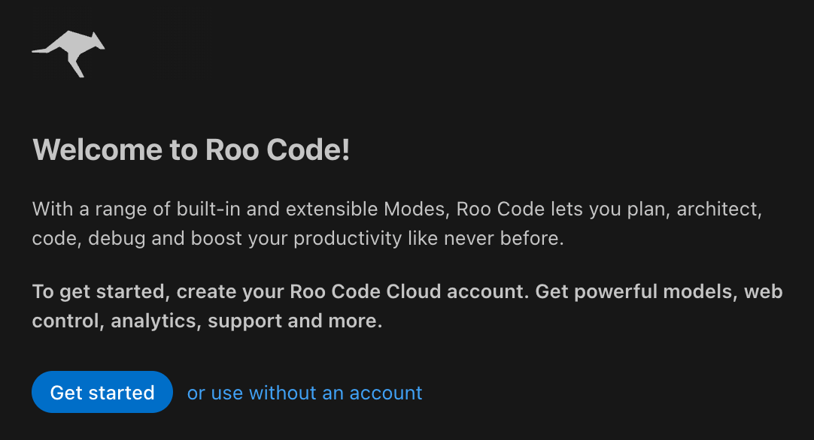

# Task: Install and Setup Roo Code

* This guide outlines the steps to install Roo Code (formerly Cline), configure it with custom instructions and MCP (Model Context Protocol), and demonstrates a usage example with a hypothetical "Context7" MCP server.

---

## 1. Install Roo Code

Roo Code is an autonomous coding agent extension for VS Code.

1.  Open **VS Code**.
2.  Go to the **Extensions** view (Click the square icon on the sidebar or press `Cmd+Shift+X`).
3.  Search for **"Roo Code"**.
4.  Look for the extension published by **RooVeterinaryInc** (ID: `RooVeterinaryInc.roo-cline`).
5.  Click **Install**.

---

## 2. Setup Roo Code

1. Once installed, you need to configure Roo Code.
2. Open the **Roo Code** sidebar by clicking the Roo Code icon on the sidebar.
3. You will see the main Roo Code interface.
4. We will go over the key configuration options during the lecture.
   * Adding API Keys (Use exiting or create new keys as needed) [https://aistudio.google.com/api-keys](Free API keys for Google Gemini)

    

    

---
## 3. Configuring Roo Code Features

### Create Profile

!!! success "Creating a Profile"
     1.  Open the **Roo Code** sidebar.
     2.  Click the **Profile** icon (user icon).
     3.  Click **"Create Profile"**.
     4.  Fill in your details and preferences.
     5.  Click **"Save Profile"**.
     6.  Your profile will help Roo Code tailor its responses to your coding style and preferences.
     7.  You can create multiple profiles for different projects or coding styles.
     8.  Switch between profiles as needed.
  
### API Keys

!!! success "Setting Up API Keys"
     1.  Open the **Roo Code** sidebar.
     2.  Click the **Settings** (gear icon).
     3.  Scroll to **"API Keys"**.
     4.  Enter your API keys for the models you want to use (e.g., OpenAI, Google Gemini).
     5.  Click **"Save"**.
     6.  Roo Code will use these keys to access the respective language models for code generation and assistance.
    
### Modes
!!! success "Setting Up Modes"
     1.  Open the **Roo Code** sidebar.
     2.  Click the **Settings** (gear icon).
     3.  Scroll to **"Default Mode"**.
     4.  Select your preferred default mode (e.g., Code, Architect, Ask).
     5.  Click **"Save"**.
     6.  This setting determines how Roo Code will approach tasks by default.

---

### 4. Advanced Configuration

#### MCP Servers

* MCP (Model Context Protocol) allows Roo Code to connect to external tools and data sources.

!!! success "Setting Up MCP Servers"
    1.  In the Roo Code sidebar, click the **MCP** icon (server icon) or go to **Settings > MCP Servers**.
    2.  Click **"Edit MCP Settings"** (Global or Project).  
    3.  This will open a JSON file for the MCP settings.
    4.  Add your MCP servers to the `mcpServers` object.
        *   Each server configuration includes the command to start the server, arguments, and environment variables if needed.
    5.  Save the file. 
    6.  Roo Code will now be able to use these MCP servers for enhanced context and capabilities.

---

### Additional Settings 

* We will cover these in the lecture.
  
    | Setting            | Description                                                                             |
    | :----------------- | :-------------------------------------------------------------------------------------- |
    | **Auto-Approve**   | Automatically approve Roo Code's suggested changes.                                     |
    | **Slash Commands** | Enable or disable slash commands for quick actions.                                     |
    | **Context**        | Configure how much file context Roo Code uses when generating code (Tabs, limits etc.). |
    | **Prompts**        | Customize prompt templates for different modes.                                         |

---

## 4. Adding Custom Instructions

* Adding custom instructions to Roo Code is a powerful way to enforce coding standards, project context, or specific AI behaviors. 
* There are three primary ways to do this: Project-specific files, the UI (Prompts Tab), and Global configuration.

#### 1. Project-Specific Instructions (Recommended)

* This is the best way to ensure that any developer working on your specific project gets the same AI behavior.

**Method A: The `.roo/rules/` Directory (Modern)**

* Roo Code now looks for a directory in your project root to load instructions.

    !!! success "Setting Up Custom Rules"
        * Create a folder named `.roo/rules/` in your project's root directory.  
        * Roo Code will read all files in this directory and apply the instructions when working on the project.   
        * Example filenames:   
          ```markdown
            coding-standards.md
            project-context.md
            api-guidelines.md
            testing-instructions.md
          ```    
        * Add any number of `.md` (Markdown) files in this directory.  
          ```markdown
            your-project/
            ├── .roo/
            │   └── rules/
            │       ├── coding-standards.md
            │       ├── project-context.md
            │       └── api-guidelines.md
            └── src/
                └── main.py

            # Each file can contain specific instructions or context for Roo Code.      
          ``` 
        *  Example content for `coding-standards.md`:
            ```markdown
            # Coding Standards
            - Follow PEP 8 for Python code.
            - Use meaningful variable names.
            - Write unit tests for all new features.
            ```
        *  This method allows for easy version control and sharing of instructions with your team.
        *  Roo Code will automatically pick up changes to these files.

---

#### 2. Using the Prompts Tab in the UI (Global/Quick Edits)

* You can also add custom instructions directly through the Roo Code UI.
* This method is less ideal for project-specific instructions but can be useful for quick adjustments.

    !!! success "Adding Custom Prompts via UI"
        *  Open the **Roo Code** sidebar.
        *  Click on the **Prompts** tab.
        *  Here, you can add or edit custom prompts for different modes.
        *  Save your changes.
* Roo Code will use these prompts when generating code.
   

