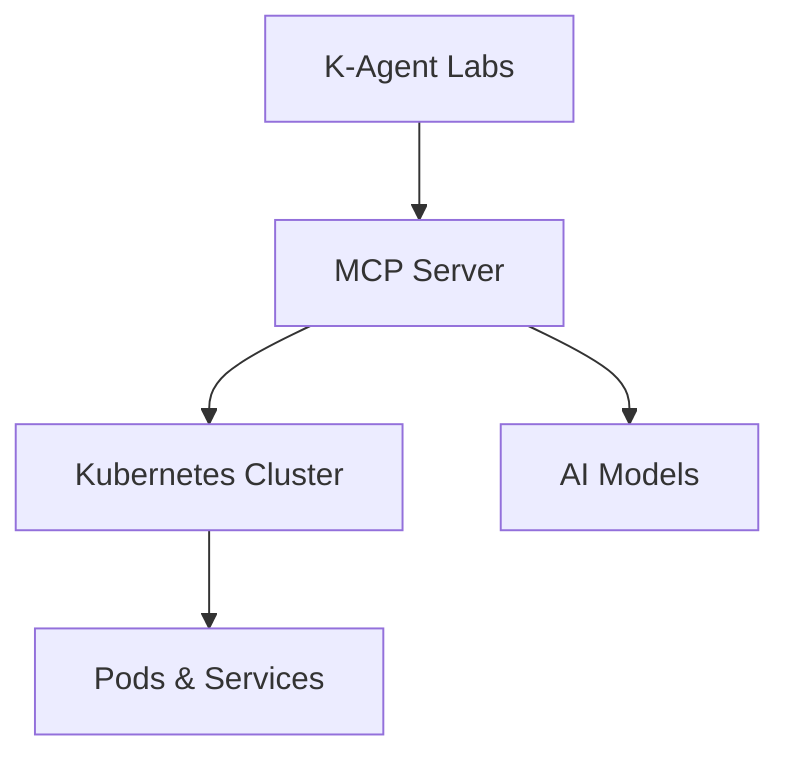
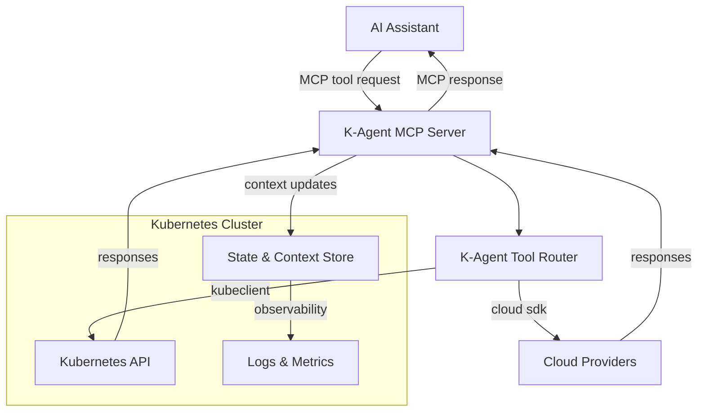

<!-- header start -->

# K8S - MCP (K-Agent Workshop)

---

!!! success "Getting Started Tip"
    * Choose the preferred way to run the labs. 
    * If you encounter any issues, please check the documentation or ask for assistance.

---

## Intro

- This tutorial is a custom made workshop for teaching AI In focus on MCP development.
- The lab is based upon **K-Agent framework** through hands-on labs designed as practical exercises.
- Each lab is packaged in its own folder and includes the files, manifests, and assets required to complete the lab.
- Every lab folder includes a `README` that describes the lab's objectives, tasks, and how to verify the solution.
- The K-Agent Labs are a series of Kubernetes and MCP automation exercises designed to teach Model Context Protocol skills & features.
- The inspiration for this project is to provide practical learning experiences for K-Agent and MCP.

## Architecture Overview

---

## Pre-Requirements

- This tutorial will test your `Kubernetes`, `MCP`, and `Python` skills.
- You should be familiar with the following topics:
    - Basic Docker and container concepts
    - Kubernetes fundamentals (pods, deployments, services)
    - Basic knowledge of YAML
    - Node.js or Python programming basics
- For advanced Labs: 
    - `MCP` protocol basics
    - `Kubernetes` advanced concepts (RBAC, ConfigMaps, Secrets)
    - `GCP` (Google Cloud Platform) basics

---

## Required Tools

- #### Visual Studio Code
  An integrated development environment (IDE) for coding, debugging, and version control.

- #### Python 3
  A versatile programming language essential for scripting and building MCP servers.

- #### Node.js
  A JavaScript runtime for building scalable network applications and MCP tools.

- #### Git
  A version control system for tracking changes in source code during development.

- #### Docker
  A platform for developing, shipping, and running applications in containers.

- #### Kubernetes (kubectl)
  A command-line tool for deploying and managing containerized applications on Kubernetes clusters.

- #### Ollama
  A tool for running large language models locally for AI assistance.

- #### MCP Inspector
  A utility for inspecting and debugging MCP protocol interactions.

---

!!! debug "Before You Begin"
    - Ensure you have the the above tools, permissions to run `Docker` commands && `Kubernetes`  on your system.
    - Enjoy, and don't forget to star the project on GitHub!

---

## Preface

### What is K-Agent?

- `K-Agent` is a Kubernetes-native tool to write `Model Context Protocol` (`MCP`) server(s), tool(s) and more.
- `K-Agent` enables AI assistants to interact with Kubernetes clusters and cloud services through standardized tools.
- `K-Agent` provides a set of MCP tools for cluster management, monitoring, and operations.
- `K-Agent` framework supports multiple transport protocols: stdio, HTTP, and WebSocket.
- `K-Agent` can be deployed as a containerized service in Kubernetes or run locally for development.

---

### What is MCP

- `MCP` - Model Context Protocol
- `MCP` is an **open standard protocol** for connecting AI assistants to **external tools** and data sources.
- `MCP` defines a standard way for AI models to discover, invoke, and interact with tools.
- `MCP` uses JSON-RPC 2.0 protocol over various transports (stdio, HTTP, WebSocket).
- `MCP` enables AI assistants to perform actions beyond text generation, such as API calls, database queries, and system operations.

---

### How Does `K-Agent` Work

- `K-Agent` acts as an `MCP server` that exposes `Kubernetes` and `cloud management capabilities` as tools.
- AI assistants connect to `K-Agent` using the `MCP protocol`.
- `K-Agent` translates MCP tool invocations into `Kubernetes API` calls or `cloud service` operations.
- Results are returned to the AI assistant in a structured format.

---

### K-Agent Architecture Flow

---

### How tDo we use this K-Agent Labs

- Here's a brief overview of how this `K-Agent Labs` work:

- #### Lab Structure
    * Each `lab` is a self-contained learning module with README, demo scripts, and resources.
    * Labs build upon each other (piled), starting with MCP basics and progressing to production deployments.
    * Each lab includes hands-on exercises and verification steps.

- #### Environment

    * Refer to the "Environment Setup" section for detailed instructions.
    * The environment is consistent across all platforms (macOS, Linux, Windows).
    * Automated scripts initialize clusters and deploy resources.

- #### Progressive Learning

    * Start with MCP fundamentals and simple tools.

    * Progress through TypeScript and Python MCP server development.

    * Learn Kubernetes deployment and management.

- #### Hands-On Practice
  
    * Each lab includes executable demo scripts for automation.

    * Verify your work with provided test scripts.

    * Build real-world MCP tools that interact with Kubernetes.

  
- The K-Agent Labs are **designed for practical learning** with a focus on hands-on experience.
  - They guide you from MCP basics to production-ready deployments.
  - Labs can be completed in any supported environment (Docker Desktop, Minikube, Kind, GKE).
  